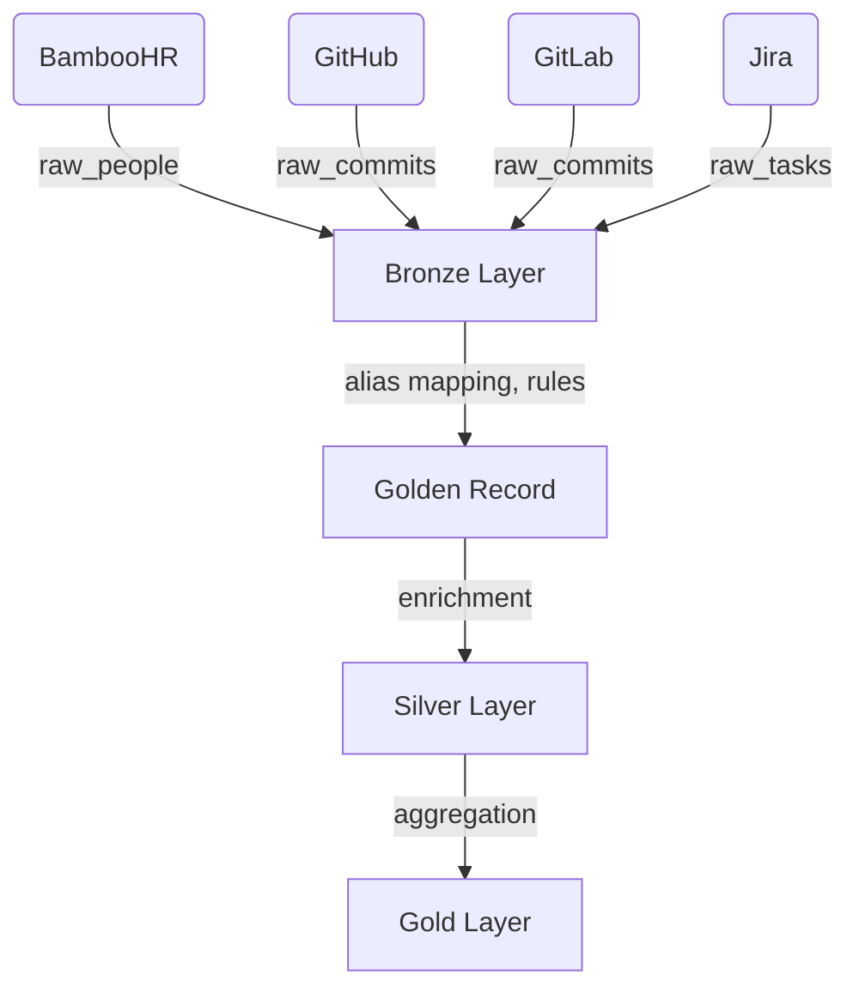

# Example: Identity Resolution Data Pipeline (Step-by-Step)

This document provides a detailed, step-by-step walkthrough of how identity and activity data from multiple source systems (HR, communications, task trackers) flows through the architecture: from raw ingestion (Bronze), through entity resolution (Golden Record), to analytical layers (Silver, Gold). Edge cases and operator involvement are illustrated.

---

## 1. Source Data: Raw Inputs from Systems


### 1.1 HR System (BambooHR)
```json
{
  "employee_id": "E123",
  "first_name": "Anna",
  "last_name": "Ivanova",
  "email": "anna.ivanova@acme.com",
  "department": "Engineering",
  "title": "Software Engineer"
}
```

### 1.2 Directory Service (Active Directory)
```json
{
  "ad_id": "aivanova",
  "name": "Anna Ivanova",
  "email": "anna.ivanova@acme.com",
  "department": "Platform Engineering"
}
```

### 1.3 Directory Service (Active Directory, after name change)
```json
{
  "ad_id": "aivanova",
  "name": "Anna Smirnova",
  "email": "anna.smirnova@acme.com",
  "department": "Platform Engineering"
}
```


### 1.4 Communications (GitHub)
```json
{
  "commit_id": "abc123",
  "github_id": "annai",
  "name": "Anna Ivanova",
  "email": "anna.ivanova@acme.com",
  "repo": "acme/api",
  "timestamp": "2024-01-10T12:00:00Z"
}
```

### 1.5 Communications (GitLab)
```json
{
  "commit_id": "def456",
  "gitlab_id": "ivanova.anna",
  "name": "Anna Ivanova",
  "email": "anna.ivanova@acme.com",
  "repo": "acme/web",
  "timestamp": "2024-01-11T09:00:00Z"
}
```

### 1.6 Task Tracker (Jira)
```json
{
  "jira_user": "aivanova",
  "display_name": "Anna Ivanova",
  "email": "anna.ivanova@acme.com",
  "issues_reported": 5
}
```

---

## 1A. How Matching and Golden Record Selection Works

### Identity Matching Rules
- Records from different systems are considered to belong to the same person if they share a unique identifier (e.g., employee_id, ad_id) or a strong secondary identifier (e.g., email, with historical alias tracking).
- If a name or email changes in one system, the linkage is maintained via alias tables and change history.
- Additional matching rules may include fuzzy name matching, cross-system user IDs, or manual operator confirmation for ambiguous cases.

### Golden Record Attribute Selection
- For each attribute (name, email, department, etc.), the value is selected based on configurable rules:
    - **Trust level**: Prefer the most trusted source (e.g., HR system over AD).
    - **Recency**: Prefer the most recently updated value.
    - **Operator review**: If sources disagree and rules cannot resolve, the record is flagged for manual review.
- All source values are preserved in the alias table for traceability and audit.

### 1.7 Edge Case: Ambiguous Department and Email
- BambooHR: `Engineering`, email = anna.ivanova@acme.com
- Active Directory: `Platform Engineering`, email = anna.ivanova@acme.com (before name change), email = anna.smirnova@acme.com (after name change)

This demonstrates that not only department, but also email and name may differ between systems or change over time. The system links all records via alias and matching rules, but the Golden Record attribute values are selected according to trust, recency, or operator review. Such conflicts are flagged for operator involvement and are fully auditable.

---

## 2. Bronze Layer: Raw Data Storage

All records are loaded as-is into raw tables, preserving source system fields and metadata:


- `raw_people` (from HR, AD)
- `raw_commits` (from GitHub, GitLab)
- `raw_tasks` (from Jira)


Example (raw_people):
| source_system | external_id   | name           | email                   | department           | ... |
|---------------|--------------|----------------|-------------------------|----------------------|-----|
| BambooHR      | E123         | Anna Ivanova   | anna.ivanova@acme.com   | Engineering          | ... |
| AD            | aivanova     | Anna Smirnova  | anna.smirnova@acme.com  | Platform Engineering | ... |

---

## 2A. Org Unit Hierarchy Example

The org_unit table stores the organizational hierarchy. Each person is linked to an org_unit via person_assignment (with SCD2 history).

Example (org_unit):
| org_unit_id | name                | parent_id | path                        | depth |
|-------------|---------------------|-----------|-----------------------------|-------|
| 10          | Company             | NULL      | /company                    | 1     |
| 20          | Engineering         | 10        | /company/engineering        | 2     |
| 21          | Platform Engineering| 20        | /company/engineering/platform| 3     |

Example (person_assignment):
| person_id | org_unit_id | valid_from  | valid_to    |
|-----------|------------|-------------|-------------|
| 1001      | 20         | 2022-01-01  | 2025-12-31  |
| 1001      | 21         | 2026-01-01  | NULL        |

This means Anna was in "Engineering" until end of 2025, then moved to "Platform Engineering" in 2026.

Example (raw_tasks):
| source_system | external_id | display_name   | email                  | ... |
|---------------|-------------|---------------|------------------------|-----|
| Jira          | aivanova    | Anna Ivanova   | anna.ivanova@acme.com  | ... |

---

## 3. Golden Record Formation (Identity Layer)


### 3.1 Alias Table
All unique identifiers (employee_id, github_id, gitlab_id, jira_user, email) are mapped to a single `person_id`. If an attribute (e.g., email) differs between systems, each value is stored as a separate alias with its own source_system.

| person_id | alias_type   | alias_value             | source_system |
|-----------|-------------|------------------------|---------------|
| 1001      | employee_id | E123                   | BambooHR      |
| 1001      | github_id   | annai                  | GitHub        |
| 1001      | gitlab_id   | ivanova.anna           | GitLab        |
| 1001      | jira_user   | aivanova               | Jira          |
| 1001      | ad_id       | aivanova               | AD            |
| 1001      | email       | anna.ivanova@acme.com  | BambooHR      |
| 1001      | email       | anna.smirnova@acme.com | AD            |


### 3.2 Golden Record Table
- Attributes are merged using rules (e.g., most trusted source, recency, operator input for conflicts). If emails differ, the system selects the preferred value (by trust, recency, or operator review):

| person_id | name           | email                   | org_unit_id | org_unit_path                  | title              | conflict_status |
|-----------|---------------|-------------------------|-------------|-------------------------------|--------------------|-----------------|
| 1001      | Anna Smirnova | anna.smirnova@acme.com  | 21          | /company/engineering/platform | Software Engineer  | Needs Review    |

*Department and email conflict: BambooHR says "Engineering" and "anna.ivanova@acme.com", AD says "Platform Engineering" and "anna.smirnova@acme.com". Operator review required. org_unit_id and org_unit_path reflect the current assignment.

---

## 4. Silver Layer: Enriched Activity

### 4.1 Commits Enriched
- Commits from GitHub and GitLab are joined to the resolved `person_id` via email/alias.

| commit_id | person_id | source_system | repo      | timestamp           |
|-----------|-----------|--------------|-----------|---------------------|
| c1        | 1001      | GitHub       | acme/api  | 2024-01-10T12:00:00 |
| c2        | 1001      | GitLab       | acme/web  | 2024-01-11T09:00:00 |

### 4.2 Tasks Enriched
- Jira issues are joined to `person_id` via alias.

| issue_id | person_id | summary                | status   |
|----------|-----------|------------------------|----------|
| J-101    | 1001      | Fix login bug          | Done     |

---

## 5. Gold Layer: Aggregated Analytics


### 5.1 Person Activity Summary
- Aggregated metrics per person, including org_unit hierarchy.

| person_id | total_commits | total_issues | org_unit_id | org_unit_path                  | department           |
|-----------|--------------|--------------|-------------|-------------------------------|----------------------|
| 1001      | 59           | 5            | 21          | /company/engineering/platform | Platform Engineering* |

You can also aggregate by any org_unit level (e.g., all under /company/engineering) using the org_unit_path or parent_id.

---

## 6. Edge Cases & Operator Involvement
- If attributes (e.g., department) differ between sources, the system flags the record for operator review.
- Operator can select the correct value or mark as unresolved.
- All changes are auditable.

---

## 7. Data Flow Visualization



---

This example demonstrates the end-to-end journey of identity and activity data, including edge cases and operator involvement, through the medallion architecture.
