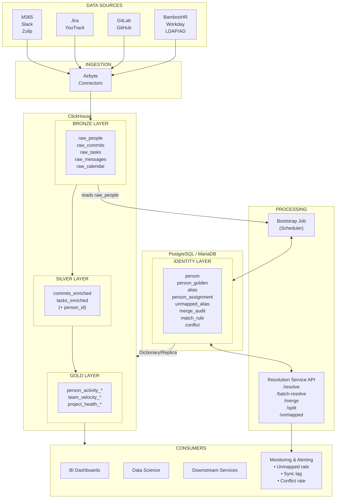
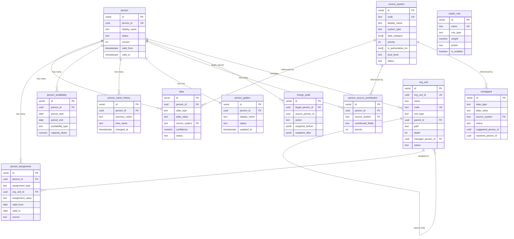

# Identity Resolution Architecture v3

> Canonical architecture for resolving and unifying person identities across data sources

**Supersedes:** [IDENTITY_RESOLUTION_V2.md](./IDENTITY_RESOLUTION_V2.md)

---

## 1. Executive Summary

Identity Resolution is the process of mapping disparate identity signals (emails, usernames, employee IDs) from multiple source systems into canonical person records. This enables cross-system analytics: correlating a person's Git commits with their Jira tasks, calendar events, and HR data.

**Key capabilities:**
- Multi-alias support (one person → many identifiers across systems)
- Full history preservation (SCD Type 2 on person and assignments)
- Department/team transfers with correct historical attribution
- Name changes, email changes, account migrations
- Merge/split operations with rollback support
- RDBMS-agnostic (PostgreSQL or MariaDB)
- **Source Federation** — combine data from multiple HR/directory systems
- **Golden Record Pattern** — assemble best values with configurable priority
- **Conflict Detection** — identify and resolve when sources disagree
- **Bronze Layer Contract** — defined schemas for raw_people, raw_commits, raw_tasks with append-only ingestion

---

### 1.1 System Architecture Overview



**Data Flow:**
- Sources → Airbyte → Bronze (ClickHouse) → Bootstrap → Identity (RDBMS)
- Bronze + Identity → Silver → Gold
- Identity ──Dictionary/Replica──▶ ClickHouse (for JOINs)

**Data Flow Summary:**

| Step | Component | Action |
|------|-----------|--------|
| 1 | Airbyte Connectors | Extract from sources → Bronze (ClickHouse) |
| 2 | Bootstrap Job | raw_people → Identity tables (RDBMS). Triggered automatically on schedule by a scheduler (e.g., Airflow, cron, or Temporal). |
| 3 | Resolution Service | Resolve aliases, merge/split, manage conflicts |
| 4 | Silver Enrichment | JOIN Bronze + Identity → Silver (ClickHouse) |
| 5 | Gold Aggregation | Aggregate Silver → Gold marts (ClickHouse) |
| 6 | Dictionary/Replica | Sync Identity → ClickHouse for fast lookups |

---

## 2. Position in Data Pipeline

Identity Resolution sits **between Bronze and Silver tiers** in the Medallion Architecture:

```
┌─────────────────────────────────────────────────────────────────────────────┐
│                              DATA PIPELINE                                  │
├─────────────────────────────────────────────────────────────────────────────┤
│                                                                             │
│   CONNECTORS          BRONZE              SILVER              GOLD          │
│   ───────────         ──────              ──────              ────          │
│                                                                             │
│   ┌─────────┐      ┌────────────┐       ┌──────────┐       ┌──────────┐     │
│   │ GitLab  │─────▶│raw_commits│──┐   │ commits    │─────▶│ person_  │     │
│   │ GitHub  │      └────────────┘  │   │ enriched  │       │ activity │     │
│   └─────────┘                      │   └───────────┘       │ summary  │     │
│                                    │         ▲             └──────────┘     │
│   ┌─────────┐      ┌────────────┐  │         │                              │
│   │ Jira    │─────▶│raw_tasks  │──┤     ┌────┴─────┐                        │
│   │ YouTrack│      └────────────┘  │    │ IDENTITY  │                       │
│   └─────────┘                      ├───▶│RESOLUTION│                        │
│                                    │    │ SERVICE   │                       │
│   ┌─────────┐      ┌────────────┐  │    └────┬──────┘                       │
│   │ M365    │─────▶│raw_mail   │──┤         │                               │
│   │ Zulip   │      └────────────┘  │         ▼                              │
│   └─────────┘                      │   ┌──────────┐                         │
│                                    │   │PostgreSQL│                         │
│   ┌─────────┐      ┌────────────┐  │   │    or    │                         │
│   │BambooHR │─────▶│raw_people │──┘   │ MariaDB  │                          │
│   │ Workday │      └────────────┘      └──────────┘                         │
│   └─────────┘           │                  │                                │
│                         │    Bootstrap     │                                │
│                         └────────────────▶│                                 │
│                                                                             │
│   ClickHouse                         External Engine / Dictionary           │
│   ══════════                         ═══════════════════════════            │
│                                                                             │
└─────────────────────────────────────────────────────────────────────────────┘
```

### Why Between Bronze and Silver?

| Principle | Rationale |
|-----------|-----------|
| **Bronze immutability** | Raw data stays unchanged; can re-process if rules change |
| **Silver = enriched** | Industry standard: Silver tier contains cleaned, validated, joined data |
| **Separation of concerns** | Connectors don't need to know about identity; they just extract |
| **Replay capability** | If identity rules improve, re-run Silver transformation |

This aligns with **Medallion Architecture** (Databricks), **Data Vault 2.0** (raw vault → business vault), and **Kimball** (staging → dimension conforming).

---

### 2.1 Terminology: Medallion Architecture & SCD Type 2

#### Medallion Architecture (Bronze → Silver → Gold)

Medallion Architecture is a multi-layered data organization pattern in Data Lake/Lakehouse, where each tier has a specific purpose:

```
┌─────────────────────────────────────────────────────────────────────────────┐
│                        MEDALLION ARCHITECTURE                                │
├─────────────────────────────────────────────────────────────────────────────┤
│                                                                              │
│   BRONZE (Raw)              SILVER (Cleaned)           GOLD (Aggregated)    │
│   ═════════════             ════════════════           ══════════════════   │
│                                                                              │
│   • Raw data as-is          • Cleaned data             • Aggregates          │
│   • Append-only             • Enriched                 • Business metrics    │
│   • Schema-on-read          • Schema-on-write          • BI-ready            │
│   • Original format         • Validated, deduplicated  • Denormalized        │
│   • Full history            • Joined with other data   • Pre-computed        │
│                                                                              │
│   raw_commits               commits_enriched           person_activity_daily │
│   raw_people               │ (+ person_id)             team_velocity_weekly  │
│   raw_tasks                 tasks_enriched             project_health_score  │
│                             (+ assignee_person_id)                           │
│                                                                              │
│   ClickHouse                ClickHouse                 ClickHouse            │
│   (ReplacingMergeTree       (join with Person Registry)(SummingMergeTree,   │
│    or MergeTree)                                        AggregatingMergeTree)│
│                                                                              │
└─────────────────────────────────────────────────────────────────────────────┘
```

| Tier | Purpose | Typical Operations | Data Quality |
|------|---------|-------------------|--------------|
| **Bronze** | Raw data archive | INSERT only | As-is from source |
| **Silver** | Cleaned, linked data | JOIN, dedup, enrich | Validated, complete |
| **Gold** | Business aggregates | GROUP BY, SUM, AVG | Ready for analysis |

**Why not transform directly to Gold?**
- Bronze allows reprocessing data if transformation rules change
- Silver can be recalculated from Bronze without re-fetching from sources
- Gold can be recalculated from Silver for different time slices/periods

#### SCD Type 2 (Slowly Changing Dimension Type 2)

SCD Type 2 is a pattern for storing historical changes in dimensions (reference tables). Instead of overwriting records, a new version is created with temporal validity:

```
┌─────────────────────────────────────────────────────────────────────────────┐
│                          SCD TYPE 2 EXAMPLE                                  │
├─────────────────────────────────────────────────────────────────────────────┤
│                                                                              │
│   Event: John Smith transfers from Engineering to Product on March 1, 2026  │
│                                                                              │
│   ══════════════════════════════════════════════════════════════════════    │
│                                                                              │
│   SCD Type 1 (overwrite — history lost):                                    │
│   ┌──────────────────────────────────────────────────────────────────┐     │
│   │  person_id │ name        │ department │ updated_at              │     │
│   │  1         │ John Smith  │ Product    │ 2026-03-01              │     │
│   └──────────────────────────────────────────────────────────────────┘     │
│   ❌ Don't know John was ever in Engineering                                │
│                                                                              │
│   ══════════════════════════════════════════════════════════════════════    │
│                                                                              │
│   SCD Type 2 (versioning — history preserved):                              │
│   ┌──────────────────────────────────────────────────────────────────┐     │
│   │  id │ person_id │ department  │ valid_from  │ valid_to          │     │
│   │  1  │ 1         │ Engineering │ 2024-01-15  │ 2026-02-28        │     │
│   │  2  │ 1         │ Product     │ 2026-03-01  │ NULL (current)    │     │
│   └──────────────────────────────────────────────────────────────────┘     │
│   ✅ Full history: know when John was in which department                   │
│                                                                              │
└─────────────────────────────────────────────────────────────────────────────┘
```

**Why SCD Type 2 matters for Identity Resolution:**

| Question | Without SCD2 | With SCD2 |
|----------|--------------|-----------|
| "Which department for commit on Feb 15?" | Product (wrong!) | Engineering ✅ |
| "When did John move to Product?" | Unknown | March 1, 2026 ✅ |
| "How many people were in Engineering in January?" | Wrong count | Accurate count ✅ |

**Query pattern for SCD Type 2:**

```sql
-- Current state (active records)
SELECT * FROM person_assignment WHERE valid_to IS NULL;

-- State at specific date (point-in-time query)
SELECT * FROM person_assignment 
WHERE '2026-02-15' BETWEEN valid_from AND COALESCE(valid_to, '9999-12-31');

-- JOIN with facts by event date
SELECT c.*, pa.department, pa.team
FROM commits c
JOIN person_assignment pa 
  ON c.person_id = pa.person_id
  AND c.commit_date BETWEEN pa.valid_from AND COALESCE(pa.valid_to, '9999-12-31');
```

---

## 3. Bronze Layer: Raw Tables Contract

### 3.1 Ingestion Philosophy

Bronze layer follows the **append-only** pattern. For production use, we recommend the **Two-Table Pattern** (see Section 3.13-3.14):
- `raw_*_history` (MergeTree) — stores all versions, full audit trail
- `raw_*_latest` (ReplacingMergeTree) — deduplicated view for pipelines

```
┌─────────────────────────────────────────────────────────────────────────────┐
│                         BRONZE INGESTION PATTERN                             │
├─────────────────────────────────────────────────────────────────────────────┤
│                                                                              │
│   Connector polls source on configurable schedule (per-connector cron)      │
│                     │                                                        │
│                     ▼                                                        │
│   ┌─────────────────────────────────────────────────────────────────────┐   │
│   │  EXTRACTION (Connector)                                              │   │
│   │                                                                      │   │
│   │  • Incremental: WHERE updated_at > last_cursor                      │   │
│   │                   AND updated_at < NOW() - safe_window              │   │
│   │    (safe_window avoids data loss from concurrent transactions)      │   │
│   │  • OR Full refresh: all records (for sources without updated_at)   │   │
│   │  • Cursor stored per connector+endpoint in state table (PostgreSQL)│   │
│   └─────────────────────────────────────────────────────────────────────┘   │
│                     │                                                        │
│                     ▼                                                        │
│   ┌─────────────────────────────────────────────────────────────────────┐   │
│   │  LOAD TO BRONZE (ClickHouse)                                         │   │
│   │                                                                      │   │
│   │  INSERT INTO raw_people (...)                                       │   │
│   │  VALUES (...)                                                        │   │
│   │                                                                      │   │
│   │  • Always INSERT, never UPDATE                                      │   │
│   │  • Same record may appear multiple times (different _synced_at)     │   │
│   │  • Two-Table Pattern: insert to both _history and _latest          │   │
│   └─────────────────────────────────────────────────────────────────────┘   │
│                     │                                                        │
│                     ▼                                                        │
│   ┌─────────────────────────────────────────────────────────────────────┐   │
│   │  TWO-TABLE PATTERN (Recommended — see Section 3.13-3.14)             │   │
│   │                                                                      │   │
│   │  raw_*_history (MergeTree):                                         │   │
│   │     • ALL versions kept forever                                     │   │
│   │     • Full audit trail                                              │   │
│   │                                                                      │   │
│   │  raw_*_latest (ReplacingMergeTree):                                 │   │
│   │     • Auto-deduped, keeps only latest                               │   │
│   │     • Safe to OPTIMIZE                                              │   │
│   │     • Used by Identity Resolution pipeline                          │   │
│   └─────────────────────────────────────────────────────────────────────┘   │
│                                                                              │
└─────────────────────────────────────────────────────────────────────────────┘
```

**⚠️ Important Notes:**

| Concern | Explanation |
|---------|-------------|
| **FINAL performance** | Adds ~10-30% overhead. For large tables, use Materialized Views or pre-aggregated tables instead |
| **OPTIMIZE history** | Running `OPTIMIZE TABLE FINAL` physically **deletes** old versions. **Never use on tables where source doesn't preserve history!** See 3.12-3.14 |
| **Safe window** | The `NOW() - safe_window` offset prevents missing records when source has concurrent writes with out-of-order timestamps |

### 3.2 Bronze Storage Engine Options

| Approach | Pros | Cons | When to Use |
|----------|------|------|-------------|
| **MergeTree (plain)** | Full history forever, simple | Manual dedup in queries | **Recommended for Bronze history** |
| **ReplacingMergeTree** | Auto-dedup, keeps latest | ⚠️ **Loses history on merge/OPTIMIZE** | Hot path queries only |
| **Two-Table Pattern** | History + fast queries | More complexity | **Production recommendation** |
| **Upsert (UPDATE or INSERT)** | Compact storage | Complex, loses history | Never in Bronze |

**See sections 3.12-3.14 for detailed history preservation strategies.**

### 3.2.1 Bronze Schema Flexibility: Raw Payload Preservation

**Problem:** Bronze tables with fixed schemas lose source-specific data that may be needed later.

```
┌─────────────────────────────────────────────────────────────────────────────┐
│                    THE SCHEMA EVOLUTION PROBLEM                              │
├─────────────────────────────────────────────────────────────────────────────┤
│                                                                              │
│   Today: We create raw_tasks with fields we think we need                   │
│                                                                              │
│   CREATE TABLE raw_tasks (                                                  │
│       task_id, title, status, assignee_id,                                  │
│       sprint_id, story_points, ...                                          │
│   )                                                                          │
│                                                                              │
│   6 months later: "We need Jira's custom field 'Business Value'"            │
│                                                                              │
│   Problem: That field was in the API response, but we didn't store it!      │
│   → Cannot backfill from Bronze (data lost)                                 │
│   → Must re-sync from source (if source still has history)                  │
│   → Jira Cloud only keeps 30 days of history → DATA GONE FOREVER            │
│                                                                              │
└─────────────────────────────────────────────────────────────────────────────┘
```

**Solution: Hybrid Schema with Mandatory `_raw_json`**

| Schema Component | Purpose | Required? |
|------------------|---------|----------|
| **Primary Key fields** | `source_system`, `task_id` | ✅ Yes |
| **Indexable fields** | Fields used in WHERE/JOIN frequently | ✅ Yes (minimal set) |
| **Timestamp fields** | `created_at`, `updated_at`, `_synced_at` | ✅ Yes |
| **Ingestion metadata** | `_connector_id`, `_batch_id` | ✅ Yes |
| **`_raw_json`** | **Complete API response** | ✅ **MANDATORY** |
| **Convenience fields** | `title`, `status`, `assignee_email` | Optional (can extract from JSON) |

**Key insight:** `_raw_json` is NOT for debugging — it's the **source of truth**. Convenience fields are just pre-extracted for query performance.

```sql
-- RECOMMENDED: Hybrid Bronze Schema
CREATE TABLE bronze.raw_tasks (
    -- === PRIMARY KEY (required for dedup/ordering) ===
    task_id             String,
    source_system       String,         -- Must match identity.source_system.code (Section 6.12)
    
    -- === INDEXABLE FIELDS (for efficient filtering) ===
    project_id          String,
    updated_at          DateTime64(3),
    
    -- === PRE-EXTRACTED CONVENIENCE FIELDS (optional, can be added later) ===
    -- These can always be re-extracted from _raw_json if schema evolves
    title               String MATERIALIZED JSONExtractString(_raw_json, 'title'),
    status              String MATERIALIZED JSONExtractString(_raw_json, 'status'),
    assignee_email      String MATERIALIZED JSONExtractString(_raw_json, 'assignee', 'email'),
    
    -- === INGESTION METADATA (required) ===
    _source_id          String,
    _source_updated_at  DateTime64(3),
    _synced_at          DateTime64(3) DEFAULT now64(3),
    _connector_id       String,
    _batch_id           String,
    
    -- === RAW PAYLOAD (MANDATORY - source of truth) ===
    _raw_json           String  -- NOT optional! Full API response
)
ENGINE = MergeTree()  -- or ReplacingMergeTree for _latest table
PARTITION BY toYYYYMM(updated_at)
ORDER BY (source_system, project_id, task_id, _synced_at);
```

**MATERIALIZED columns:** ClickHouse extracts values from `_raw_json` at INSERT time and stores them as regular columns. No runtime JSON parsing overhead.

**Schema evolution workflow:**

```
┌─────────────────────────────────────────────────────────────────────────────┐
│                    ADDING NEW FIELD FROM _raw_json                           │
├─────────────────────────────────────────────────────────────────────────────┤
│                                                                              │
│   1. Need a new field? Extract from existing _raw_json:                     │
│                                                                              │
│      SELECT                                                                  │
│          task_id,                                                            │
│          JSONExtractFloat(_raw_json, 'fields', 'customfield_10042')         │
│              AS business_value                                               │
│      FROM bronze.raw_tasks                                                  │
│      WHERE source_system = 'jira'                                           │
│                                                                              │
│   2. Want it as a regular column? Add MATERIALIZED:                         │
│                                                                              │
│      ALTER TABLE bronze.raw_tasks                                           │
│      ADD COLUMN business_value Float32                                       │
│          MATERIALIZED JSONExtractFloat(_raw_json, 'fields', 'customfield_10042');
│                                                                              │
│   3. Backfill existing rows:                                                │
│                                                                              │
│      ALTER TABLE bronze.raw_tasks                                           │
│      UPDATE business_value = JSONExtractFloat(...)                          │
│      WHERE source_system = 'jira';                                          │
│                                                                              │
└─────────────────────────────────────────────────────────────────────────────┘
```

**Source-specific JSON examples:**

```json
// Jira _raw_json
{
  "id": "10042",
  "key": "PROJ-123",
  "fields": {
    "summary": "Fix login bug",
    "status": {"name": "In Progress"},
    "assignee": {"emailAddress": "john@corp.com"},
    "customfield_10042": 8.5,  // Business Value - Jira specific
    "customfield_10015": "2026-Q1"  // Target Quarter - Jira specific
  }
}

// YouTrack _raw_json  
{
  "id": "YT-456",
  "summary": "Fix login bug",
  "state": {"name": "In Progress"},
  "assignee": {"email": "john@corp.com"},
  "customFields": [
    {"name": "Subsystem", "value": "Auth"},  // YouTrack specific
    {"name": "Estimation", "value": {"minutes": 480}}  // YouTrack specific
  ]
}

// Linear _raw_json
{
  "id": "LIN-789",
  "title": "Fix login bug",
  "state": {"name": "In Progress"},
  "assignee": {"email": "john@corp.com"},
  "cycle": {"name": "Sprint 42"},  // Linear specific (not sprint_id)
  "estimate": 5  // Linear specific (not story_points)
}
```

All source-specific fields are preserved in `_raw_json` and can be extracted anytime.

### 3.2.2 Normalization Strategy: Connector vs Bootstrap Job

**Question:** Data from Workday, BambooHR, and AD arrives in different formats. Where should normalization happen?

```
┌─────────────────────────────────────────────────────────────────────────────┐
│                    NORMALIZATION ARCHITECTURE DECISION                       │
├─────────────────────────────────────────────────────────────────────────────┤
│                                                                              │
│   OPTION A: Normalize in Connector (RECOMMENDED)                            │
│   ─────────────────────────────────────────────────                         │
│                                                                              │
│   Workday API ──▶ Workday Connector ──▶ raw_people (unified schema)        │
│                   ├─ primary_email = record['emailAddress']                 │
│                   ├─ display_name = record['preferredName']                 │
│                   └─ _raw_json = original response                          │
│                                                                              │
│   BambooHR API ─▶ BambooHR Connector ─▶ raw_people (same unified schema)   │
│                   ├─ primary_email = record['workEmail']                    │
│                   ├─ display_name = firstName + " " + lastName              │
│                   └─ _raw_json = original response                          │
│                                                                              │
│   AD/LDAP ──────▶ LDAP Connector ────▶ raw_people (same unified schema)    │
│                   ├─ primary_email = record['mail']                         │
│                   ├─ display_name = record['displayName']                   │
│                   └─ _raw_json = original response                          │
│                                                                              │
│   Bootstrap Job: reads unified fields, NO source-specific logic            │
│                                                                              │
│   ══════════════════════════════════════════════════════════════════════    │
│                                                                              │
│   OPTION B: Normalize in Bootstrap Job (NOT recommended)                    │
│   ───────────────────────────────────────────────────────                   │
│                                                                              │
│   All APIs ────▶ Generic Connector ──▶ raw_people (_raw_json only)         │
│                                              │                               │
│                                              ▼                               │
│   Bootstrap Job:                                                             │
│     if source_system == 'workday':                                          │
│         email = JSONExtract(_raw_json, 'emailAddress')                      │
│     elif source_system == 'bamboohr':                                       │
│         email = JSONExtract(_raw_json, 'workEmail')                         │
│     elif source_system == 'ldap':                                           │
│         email = JSONExtract(_raw_json, 'mail')                              │
│     ...                                                                      │
│                                                                              │
│   Problem: Bootstrap Job becomes complex, tightly coupled to all sources    │
│                                                                              │
└─────────────────────────────────────────────────────────────────────────────┘
```

**Why Option A (Connector Normalization) is recommended:**

| Factor | Option A (Connector) | Option B (Bootstrap) |
|--------|---------------------|---------------------|
| **Connector complexity** | Each connector knows its source | Generic, simple |
| **Bootstrap complexity** | Simple, source-agnostic | Complex, switch per source |
| **Adding new source** | New connector only | New connector + Bootstrap changes |
| **Testing** | Test connector in isolation | Must test Bootstrap for each source |
| **Separation of concerns** | ✅ Clear boundaries | ❌ Mixed responsibilities |
| **Bronze queryability** | Direct SELECT on unified fields | Must parse JSON per source |

**Implementation: Connector normalizes to unified schema**

```python
# Each connector normalizes to SAME schema
class WorkdayConnector(BaseHRConnector):
    def transform(self, record) -> dict:
        return {
            # Unified fields (same for all HR connectors)
            'employee_id': record['employeeID'],
            'source_system': 'workday',
            
            # Emails (primary + additional)
            'primary_email': record['emailAddress'],
            'additional_emails': record.get('additionalEmails', []),
            
            # Identity
            'display_name': record['preferredName'] or f"{record['firstName']} {record['lastName']}",
            'username': record.get('userId'),  # Workday login
            
            # Status & dates
            'status': self.map_status(record['workerStatus']),
            'start_date': self.parse_date(record.get('hireDate')),
            'termination_date': self.parse_date(record.get('terminationDate')),
            
            # Organizational
            'department': record.get('supervisoryOrganization', {}).get('name'),
            'team': record.get('team', {}).get('name'),
            'title': record.get('businessTitle'),
            'manager_employee_id': record.get('manager', {}).get('employeeID'),
            
            # Raw payload for future schema evolution
            '_raw_json': json.dumps(record)
        }

class BambooHRConnector(BaseHRConnector):
    def transform(self, record) -> dict:
        # BambooHR may have multiple emails in customFields
        additional = [record.get('homeEmail')] if record.get('homeEmail') else []
        
        return {
            'employee_id': record['id'],
            'source_system': 'bamboohr',
            
            'primary_email': record['workEmail'],
            'additional_emails': additional,
            
            'display_name': f"{record['firstName']} {record['lastName']}",
            'username': record.get('workEmail', '').split('@')[0],  # Derive from email
            
            'status': self.map_status(record['status']),
            'start_date': self.parse_date(record.get('hireDate')),
            'termination_date': self.parse_date(record.get('terminationDate')),
            
            'department': record.get('department'),
            'team': record.get('division'),  # BambooHR calls it "division"
            'title': record.get('jobTitle'),
            'manager_employee_id': record.get('supervisorId'),
            
            '_raw_json': json.dumps(record)
        }

class LDAPConnector(BaseHRConnector):
    def transform(self, record) -> dict:
        # LDAP may have proxyAddresses with multiple emails
        proxy_emails = self.extract_proxy_emails(record.get('proxyAddresses', []))
        
        return {
            'employee_id': record['employeeNumber'] or record['sAMAccountName'],
            'source_system': 'ldap',
            
            'primary_email': record['mail'],
            'additional_emails': proxy_emails,
            
            'display_name': record['displayName'],
            'username': record['sAMAccountName'],  # AD login name
            
            'status': 'active' if record.get('userAccountControl') != 514 else 'inactive',
            'start_date': None,  # LDAP often doesn't have hire date
            'termination_date': None,
            
            'department': record.get('department'),
            'team': record.get('division'),
            'title': record.get('title'),
            'manager_employee_id': self.extract_manager_id(record.get('manager')),
            
            '_raw_json': json.dumps(record)
        }
    
    def extract_proxy_emails(self, proxy_addresses: list) -> list:
        """Extract SMTP addresses from AD proxyAddresses"""
        # proxyAddresses: ['SMTP:john@corp.com', 'smtp:j.smith@corp.com']
        return [addr[5:] for addr in proxy_addresses 
                if addr.lower().startswith('smtp:') and addr != f'SMTP:{self.primary_email}']
```

**Bootstrap Job: Source-agnostic (reads unified fields)**

```python
# Bootstrap Job does NOT know about source-specific formats
def bootstrap_person(record: dict):
    """
    Works with ANY source - fields are already normalized by connector.
    Uses unified schema fields, never parses _raw_json.
    """
    
    # 1. Find or create person
    person_id = find_or_create_person(
        employee_id=record['employee_id'],
        source_system=record['source_system'],
        display_name=record['display_name'],
        status=record['status']
    )
    
    # 2. Create aliases (for cross-system matching)
    create_alias(person_id, 'employee_id', record['employee_id'], record['source_system'])
    create_alias(person_id, 'email', record['primary_email'], record['source_system'])
    
    # Additional emails as separate aliases
    for email in record.get('additional_emails', []):
        create_alias(person_id, 'email', email, record['source_system'])
    
    # Username alias (for Git/Jira matching)
    if record.get('username'):
        create_alias(person_id, 'username', record['username'], record['source_system'])
    
    # 3. Create organizational assignments (SCD Type 2)
    valid_from = record.get('start_date') or date.today()
    
    if record.get('department'):
        create_assignment(person_id, 'department', record['department'], valid_from)
    
    if record.get('team'):
        create_assignment(person_id, 'team', record['team'], valid_from)
    
    # 4. Create Golden Record
    create_golden_record(person_id, record['display_name'], record['status'], 
                        record['source_system'])
    
    return person_id
```

**Unified Schema Fields Summary:**

| Field | Type | Purpose | Used In |
|-------|------|---------|---------|
| `employee_id` | String | Primary key per source | alias |
| `source_system` | String | Source identifier | all |
| `primary_email` | String | Main work email | alias (email) |
| `additional_emails` | Array | Other emails | alias (email) |
| `display_name` | String | Full name | person, person_golden |
| `username` | String | Login/username | alias (username) |
| `status` | String | Employment status | person, person_golden |
| `start_date` | Date | Hire date | person_assignment.valid_from |
| `termination_date` | Date | Exit date | person.valid_to |
| `department` | String | Department name | person_assignment |
| `team` | String | Team within dept | person_assignment |
| `title` | String | Job title | (future use) |
| `manager_employee_id` | String | Manager reference | (future: org hierarchy) |

**Key principle:** Each connector is an expert on its source system. Bootstrap Job is an expert on Identity Resolution. Keep responsibilities separate.

### 3.3 `raw_people` Table Schema (ClickHouse)

**⚠️ Note:** This shows a simplified single-table schema. For production, use the **Two-Table Pattern** (Section 3.13-3.14):
- `raw_people_history` (MergeTree) — full audit trail, never optimized
- `raw_people_latest` (ReplacingMergeTree) — deduplicated, used for pipelines

The schema below can be used for either table (just change the engine):

```sql
-- For Two-Table Pattern: create both tables with this schema
-- raw_people_history: ENGINE = MergeTree()
-- raw_people_latest:  ENGINE = ReplacingMergeTree(_synced_at)

CREATE TABLE bronze.raw_people (
    -- === PRIMARY KEY FIELDS ===
    employee_id         String,         -- HR system identifier
    source_system       String,         -- FK: identity.source_system.code (Section 6.12)
    
    -- === PRE-EXTRACTED CONVENIENCE FIELDS ===
    -- Can always be re-extracted from _raw_json if schema evolves
    -- These are the MINIMUM fields needed for Identity Resolution
    
    -- Person identity
    primary_email       String,                     -- Main work email
    additional_emails   Array(String) DEFAULT [],   -- Aliases, personal email, etc.
    display_name        String,
    username            Nullable(String),           -- Login/username for cross-system matching
    
    -- Status & dates
    status              String,                     -- active, inactive, terminated, on_leave
    start_date          Nullable(Date),             -- Hire date (for SCD2 valid_from)
    termination_date    Nullable(Date),             -- When person left (for closing records)
    
    -- Organizational
    department          Nullable(String),
    team                Nullable(String),           -- Team within department
    title               Nullable(String),
    manager_employee_id Nullable(String),
    
    -- === SOURCE METADATA ===
    _source_id          String,         -- Original ID from source system
    _source_updated_at  DateTime64(3),  -- When record was updated in source
    
    -- === INGESTION METADATA ===
    _synced_at          DateTime64(3) DEFAULT now64(3),
    _connector_id       String,
    _batch_id           String,
    
    -- === RAW PAYLOAD (MANDATORY - source of truth) ===
    _raw_json           String          -- Full API response, enables schema evolution
)
ENGINE = ReplacingMergeTree(_synced_at)
PARTITION BY toYYYYMM(_synced_at)
ORDER BY (source_system, employee_id)
SETTINGS index_granularity = 8192;

-- Extract source-specific fields at query time:
-- Workday: JSONExtractString(_raw_json, 'Worker', 'Worker_Data', 'Employment_Data', 'Position_Data', 'Position_Title')
-- BambooHR: JSONExtract(_raw_json, 'customFields', 'Array(JSON)') for custom fields
-- LDAP: JSONExtractString(_raw_json, 'memberOf') for group membership

-- Indexes for cross-source matching lookups
ALTER TABLE bronze.raw_people ADD INDEX idx_email primary_email TYPE bloom_filter GRANULARITY 1;
ALTER TABLE bronze.raw_people ADD INDEX idx_username username TYPE bloom_filter GRANULARITY 1;

-- For searching in additional_emails array:
-- SELECT * FROM raw_people WHERE has(additional_emails, 'john.alias@corp.com')
```

### 3.4 Other Raw Tables

```sql
-- raw_commits: Git activity from GitLab, GitHub, Bitbucket
-- Note: Uses Hybrid Schema - minimal indexed fields + full _raw_json
CREATE TABLE bronze.raw_commits (
    -- === PRIMARY KEY FIELDS ===
    commit_hash         String,
    repo_id             String,
    source_system       String,         -- FK: identity.source_system.code
    
    -- === TIMESTAMPS ===
    commit_date         DateTime64(3),
    
    -- === PRE-EXTRACTED CONVENIENCE FIELDS ===
    author_email        String,
    author_name         String,
    lines_added         UInt32 DEFAULT 0,
    lines_deleted       UInt32 DEFAULT 0,
    files_changed       UInt32 DEFAULT 0,
    
    -- === INGESTION METADATA ===
    _source_id          String,
    _source_updated_at  DateTime64(3),
    _synced_at          DateTime64(3) DEFAULT now64(3),
    _connector_id       String,
    _batch_id           String,
    
    -- === RAW PAYLOAD (MANDATORY) ===
    _raw_json           String          -- Full commit object (diff stats, parents, GPG sig, etc.)
)
ENGINE = ReplacingMergeTree(_synced_at)
PARTITION BY toYYYYMM(commit_date)
ORDER BY (source_system, repo_id, commit_hash);

-- Extract source-specific fields at query time:
-- GitHub: JSONExtractBool(_raw_json, 'commit', 'verification', 'verified') AS gpg_verified
-- GitLab: JSONExtract(_raw_json, 'stats', 'JSON') for detailed diff stats
-- Bitbucket: JSONExtractString(_raw_json, 'links', 'html', 'href') AS web_url


-- raw_tasks: Issues/tasks from Jira, YouTrack, Linear
-- Note: Uses Hybrid Schema - minimal indexed fields + full _raw_json
CREATE TABLE bronze.raw_tasks (
    -- === PRIMARY KEY FIELDS ===
    task_id             String,         -- Jira key, YouTrack ID, Linear ID
    source_system       String,         -- FK: identity.source_system.code
    project_id          String,
    
    -- === TIMESTAMPS (for partitioning/filtering) ===
    created_at          DateTime64(3),
    updated_at          DateTime64(3),
    
    -- === PRE-EXTRACTED CONVENIENCE FIELDS ===
    -- Can always be re-extracted from _raw_json if needed
    title               String,
    status              String,
    assignee_email      Nullable(String),
    
    -- === INGESTION METADATA ===
    _source_id          String,
    _source_updated_at  DateTime64(3),
    _synced_at          DateTime64(3) DEFAULT now64(3),
    _connector_id       String,
    _batch_id           String,
    
    -- === RAW PAYLOAD (MANDATORY - source of truth) ===
    _raw_json           String          -- Full API response, enables schema evolution
)
ENGINE = ReplacingMergeTree(_synced_at)
PARTITION BY toYYYYMM(updated_at)
ORDER BY (source_system, project_id, task_id);

-- Extract source-specific fields at query time:
-- Jira: JSONExtractFloat(_raw_json, 'fields', 'customfield_10042') AS story_points
-- YouTrack: JSONExtract(_raw_json, 'customFields', 'Array(JSON)') for custom fields
-- Linear: JSONExtractFloat(_raw_json, 'estimate') AS estimate


-- raw_messages: Communication from Slack, Zulip, Teams
-- Note: Uses Hybrid Schema - minimal indexed fields + full _raw_json
CREATE TABLE bronze.raw_messages (
    -- === PRIMARY KEY FIELDS ===
    message_id          String,
    source_system       String,         -- FK: identity.source_system.code
    channel_id          String,
    
    -- === TIMESTAMPS ===
    sent_at             DateTime64(3),
    
    -- === PRE-EXTRACTED CONVENIENCE FIELDS ===
    sender_id           String,
    sender_email        Nullable(String),
    content_length      UInt32,         -- for metrics, actual content in _raw_json
    
    -- === INGESTION METADATA ===
    _source_id          String,
    _source_updated_at  DateTime64(3),
    _synced_at          DateTime64(3) DEFAULT now64(3),
    _connector_id       String,
    _batch_id           String,
    
    -- === RAW PAYLOAD (MANDATORY) ===
    _raw_json           String          -- Full message metadata (content may be hashed/redacted)
)
ENGINE = ReplacingMergeTree(_synced_at)
PARTITION BY toYYYYMM(sent_at)
ORDER BY (source_system, channel_id, message_id);
```

### 3.5 Connector Sync Pattern

```python
class HRConnector:
    """
    Example: BambooHR connector with configurable schedule and safe window
    """
    
    def __init__(self, config):
        self.source_system = 'bamboohr'
        self.connector_id = f"bamboohr-{config.tenant_id}"
        
        # Per-connector configuration
        self.schedule = config.get('schedule', '*/15 * * * *')  # Default: every 15 min
        self.sync_mode = config.get('sync_mode', 'incremental')  # incremental | full_refresh
        self.safe_window_minutes = config.get('safe_window_minutes', 1)  # Offset to avoid data loss
        
    def sync(self):
        # 1. Get last sync cursor from state
        last_cursor = self.get_state('last_sync_cursor')  # e.g., '2026-02-13T10:00:00Z'
        
        # 2. Calculate safe upper bound (avoid volatile recent data)
        safe_upper_bound = datetime.utcnow() - timedelta(minutes=self.safe_window_minutes)
        
        # 3. Extract from source (incremental or full)
        if self.sync_mode == 'incremental' and last_cursor:
            # Incremental: only changed records within safe window
            # This avoids missing records from concurrent transactions
            records = self.api.get_employees(
                updated_since=last_cursor,
                updated_before=safe_upper_bound  # ← Key: don't sync most recent data
            )
        else:
            # Full refresh: first sync, reset, or source doesn't support incremental
            records = self.api.get_all_employees()
        
        # 3. Transform to raw_people schema (Hybrid Schema pattern)
        batch_id = str(uuid4())
        rows = []
        for record in records:
            rows.append({
                # Primary keys
                'employee_id': record['id'],
                'source_system': self.source_system,
                
                # Pre-extracted convenience fields (can be re-extracted from _raw_json)
                'primary_email': record['workEmail'],
                'display_name': f"{record['firstName']} {record['lastName']}",
                'status': self.map_status(record['status']),
                'department': record.get('department'),
                'title': record.get('jobTitle'),
                'manager_employee_id': record.get('supervisorId'),
                
                # Ingestion metadata
                '_source_id': record['id'],
                '_source_updated_at': record['lastChanged'],
                '_connector_id': self.connector_id,
                '_batch_id': batch_id,
                
                # RAW PAYLOAD - MANDATORY! Source of truth for schema evolution
                '_raw_json': json.dumps(record)
            })
        
        # 4. Load to ClickHouse (INSERT, not UPDATE!)
        if rows:
            self.clickhouse.insert('bronze.raw_people', rows)
        
        # 5. Update sync cursor to safe_upper_bound (not max record timestamp!)
        # This ensures next sync starts from where we stopped, not from latest record
        if rows:
            self.set_state('last_sync_cursor', safe_upper_bound.isoformat())
        
        return {'records_synced': len(rows), 'batch_id': batch_id}
```

**Why `safe_upper_bound` matters:**

```
┌─────────────────────────────────────────────────────────────────────────────┐
│          CONCURRENT TRANSACTION PROBLEM (without safe_window)               │
├─────────────────────────────────────────────────────────────────────────────┤
│                                                                              │
│   Timeline:                                                                  │
│   ────────────────────────────────────────────────────────────────────►     │
│                                                                              │
│   10:00:00.100  Transaction A starts (updated_at = 10:00:00.100)           │
│   10:00:00.200  Transaction B starts (updated_at = 10:00:00.200)           │
│   10:00:00.250  Transaction B commits (faster connection pool)              │
│   10:00:00.300  Our sync runs, sees B, sets cursor = 10:00:00.200          │
│   10:00:00.400  Transaction A commits (slower, but earlier updated_at!)    │
│                                                                              │
│   Result: Transaction A is LOST forever (cursor already past it)            │
│                                                                              │
├─────────────────────────────────────────────────────────────────────────────┤
│          SOLUTION: safe_window_minutes = 1                                   │
├─────────────────────────────────────────────────────────────────────────────┤
│                                                                              │
│   Sync at 10:00:00.300:                                                     │
│     WHERE updated_at > last_cursor                                          │
│       AND updated_at < NOW() - 1 minute                                     │
│     → upper_bound = 09:59:00.300                                            │
│     → Transaction A and B both have updated_at > 09:59:00, so NOT synced   │
│                                                                              │
│   Next sync at 10:01:00.300:                                                │
│     → upper_bound = 10:00:00.300                                            │
│     → Both A and B are now within range and synced correctly               │
│                                                                              │
└─────────────────────────────────────────────────────────────────────────────┘
```

### 3.6 How ReplacingMergeTree Handles Duplicates

> **ℹ️ Note:** This section explains ReplacingMergeTree mechanics for educational purposes. For production, we recommend the **Two-Table Pattern** (see Section 3.13-3.14) which uses MergeTree for history + ReplacingMergeTree for hot-path queries.

```
┌─────────────────────────────────────────────────────────────────────────────┐
│                    REPLACINGMERGETREE DEDUPLICATION                          │
├─────────────────────────────────────────────────────────────────────────────┤
│                                                                              │
│   Sync 1 (10:00):                                                           │
│   INSERT INTO raw_people VALUES                                             │
│     ('EMP-123', 'workday', 'john@corp.com', 'John Smith', 'Engineering',   │
│      '2026-02-14 10:00:00')                                                 │
│                                                                              │
│   Sync 2 (10:05):  -- John's department changed in Workday                  │
│   INSERT INTO raw_people VALUES                                             │
│     ('EMP-123', 'workday', 'john@corp.com', 'John Smith', 'Product',       │
│      '2026-02-14 10:05:00')                                                 │
│                                                                              │
│   ══════════════════════════════════════════════════════════════════════    │
│                                                                              │
│   Physical storage (both rows exist):                                       │
│   ┌──────────────────────────────────────────────────────────────────┐     │
│   │  EMP-123 │ workday │ Engineering │ 2026-02-14 10:00:00          │     │
│   │  EMP-123 │ workday │ Product     │ 2026-02-14 10:05:00          │     │
│   └──────────────────────────────────────────────────────────────────┘     │
│                                                                              │
│   Query WITHOUT FINAL:                                                      │
│   SELECT * FROM raw_people WHERE employee_id = 'EMP-123'                    │
│   → Returns BOTH rows (may see duplicates)                                  │
│                                                                              │
│   Query WITH FINAL:                                                         │
│   SELECT * FROM raw_people FINAL WHERE employee_id = 'EMP-123'              │
│   → Returns ONLY latest: 'Product', '2026-02-14 10:05:00'                  │
│                                                                              │
│   Background optimization (runs periodically):                              │
│   OPTIMIZE TABLE raw_people FINAL                                           │
│   → Physically removes old versions, keeps only latest                      │
│                                                                              │
└─────────────────────────────────────────────────────────────────────────────┘
```

### 3.7 History Tracking: Bronze vs Identity Layer

> **Cross-references:** 
> - **Section 5** — Storage Architecture (why RDBMS for Identity)
> - **Section 7** — ClickHouse Integration and performance considerations
> - **Section 15** — Synchronization strategies for cross-system joins

| Concern | Bronze (ClickHouse) | Identity (PostgreSQL/MariaDB) |
|---------|---------------------|-------------------------------|
| **Purpose** | Store raw snapshots from source | Track person state changes |
| **History model** | Two-Table pattern (recommended) | SCD Type 2 (valid_from/valid_to) |
| **What's kept** | All versions in _history table | Every state change with timestamps |
| **Query pattern** | Use _latest table for current | `WHERE valid_to IS NULL` for current |
| **Why two systems?** | ClickHouse: analytics at scale | RDBMS: ACID, complex updates, referential integrity |

**⚠️ Performance note:** Identity data lives in RDBMS, but heavy analytical queries run in ClickHouse. Section 15 covers synchronization strategies (Dictionary, Local Replica) to avoid slow cross-system JOINs.

**Key insight:** Bronze keeps "what we synced" (full history), Identity keeps "what changed and when" (SCD Type 2 semantics).

### 3.8 Full Refresh vs Incremental

| Pattern | When to Use | Implementation | Source Requirement |
|---------|-------------|----------------|--------------------|
| **Incremental** | Large tables, frequent syncs | `WHERE updated_at > cursor AND updated_at < NOW() - safe_window` | Source MUST expose `updated_at` or equivalent |
| **Full refresh** | Small tables (<10K rows), no reliable cursor | Sync all, ReplacingMergeTree dedupes | None — works for any source |
| **Hybrid** | Medium tables | Full refresh daily, incremental hourly | Preferred if source supports both |

**⚠️ Incremental sync requirements:**
- Source system must expose a reliable `updated_at` (or `modified_at`, `lastChanged`) field
- Field must be indexed in source for efficient queries
- Source must support range queries (`updated_at > X AND updated_at < Y`)
- If source doesn't support this, fall back to Full Refresh

```python
# Full refresh connector example
class LDAPConnector:
    def sync(self):
        # LDAP often doesn't have reliable updated_at
        # Full refresh every sync, dedupe handles it
        all_users = self.ldap.get_all_users()
        
        batch_id = str(uuid4())
        rows = [self.transform(u, batch_id) for u in all_users]
        
        # INSERT all (ReplacingMergeTree keeps latest per employee_id)
        self.clickhouse.insert('bronze.raw_people', rows)
```

### 3.9 Do We Need to Merge in Bronze?

**No.** Bronze is intentionally denormalized and append-only:

| Question | Answer |
|----------|--------|
| Multiple syncs of same record? | Depends on engine choice (see 3.13) |
| Same person from different sources? | Different `source_system` = different rows, merged in Identity layer |
| Need historical changes? | Use MergeTree or Two-Table pattern (see 3.13-3.14) |
| When to merge? | Never in Bronze. Source Federation happens in Identity Resolution |

**⚠️ Important:** If using ReplacingMergeTree, history will be lost during background merges or OPTIMIZE. See sections 3.12-3.14 for history preservation strategies.

### 3.10 Connector State Management

The **state table** stores sync cursors and configuration per connector. It lives in PostgreSQL (same DB as Identity Resolution):

```sql
-- PostgreSQL: Connector State Table
CREATE TABLE connector_state (
    connector_id        VARCHAR(255) NOT NULL,
    endpoint_name       VARCHAR(255) NOT NULL DEFAULT '_default',  -- For multi-endpoint connectors
    
    -- Sync state
    last_sync_cursor    TIMESTAMPTZ,
    last_sync_at        TIMESTAMPTZ,
    last_sync_status    VARCHAR(50),        -- success, failed, partial
    last_sync_records   INTEGER DEFAULT 0,
    last_error_message  TEXT,
    
    -- Configuration
    schedule_cron       VARCHAR(100) NOT NULL DEFAULT '*/15 * * * *',  -- Cron expression
    sync_mode           VARCHAR(50) NOT NULL DEFAULT 'incremental',    -- incremental, full_refresh
    safe_window_minutes INTEGER NOT NULL DEFAULT 1,
    is_enabled          BOOLEAN NOT NULL DEFAULT TRUE,
    
    -- Metadata
    created_at          TIMESTAMPTZ NOT NULL DEFAULT NOW(),
    updated_at          TIMESTAMPTZ NOT NULL DEFAULT NOW(),
    
    PRIMARY KEY (connector_id, endpoint_name)
);

-- Example data
INSERT INTO connector_state (connector_id, endpoint_name, schedule_cron, sync_mode, safe_window_minutes)
VALUES 
    ('bamboohr-acme', '_default', '*/15 * * * *', 'incremental', 1),
    ('hubspot-acme', 'emails', '*/30 * * * *', 'incremental', 2),
    ('hubspot-acme', 'contacts', '0 * * * *', 'incremental', 1),      -- Hourly
    ('ldap-corp', '_default', '0 */6 * * *', 'full_refresh', 0);      -- Every 6 hours, full
```

**State methods in connector base class:**

```python
class BaseConnector:
    def get_state(self, key: str) -> Optional[str]:
        """Get value from state table for this connector+endpoint"""
        row = self.db.execute(
            "SELECT last_sync_cursor FROM connector_state "
            "WHERE connector_id = %s AND endpoint_name = %s",
            (self.connector_id, self.current_endpoint or '_default')
        ).fetchone()
        return row[0] if row else None
    
    def set_state(self, key: str, value: str):
        """Update state in table (upsert)"""
        self.db.execute("""
            INSERT INTO connector_state (connector_id, endpoint_name, last_sync_cursor, last_sync_at, updated_at)
            VALUES (%s, %s, %s, NOW(), NOW())
            ON CONFLICT (connector_id, endpoint_name)
            DO UPDATE SET last_sync_cursor = %s, last_sync_at = NOW(), updated_at = NOW()
        """, (self.connector_id, self.current_endpoint or '_default', value, value))
```

**Scheduler reads from this table:**

```python
# Scheduler daemon (runs continuously)
while True:
    connectors = db.execute("""
        SELECT connector_id, endpoint_name, schedule_cron, sync_mode, safe_window_minutes
        FROM connector_state
        WHERE is_enabled = TRUE
          AND (last_sync_at IS NULL OR 
               last_sync_at < NOW() - make_interval(mins => safe_window_minutes))
        ORDER BY last_sync_at NULLS FIRST
    """).fetchall()
    
    for conn in connectors:
        if cron_matches_now(conn.schedule_cron):
            run_connector(conn.connector_id, conn.endpoint_name)
    
    sleep(60)  # Check every minute
```

### 3.11 FINAL Performance Considerations

> **ℹ️ Note:** This section discusses FINAL for ReplacingMergeTree. If you use the **recommended Two-Table Pattern** (Section 3.14), use `raw_*_latest` tables directly — they are already deduplicated, no FINAL needed.

**Problem:** `SELECT ... FINAL` forces ClickHouse to deduplicate on-the-fly, which adds CPU overhead.

| Table Size | FINAL Overhead | Recommendation |
|------------|----------------|----------------|
| < 1M rows | ~5-10% | Acceptable for simple setups |
| 1M - 100M rows | ~10-30% | Use Two-Table Pattern |
| > 100M rows | ~30-50%+ | **Must** use Two-Table Pattern |

**Solutions (in order of preference):**

```sql
-- SOLUTION 1 (RECOMMENDED): Two-Table Pattern
-- See Section 3.13-3.14 for full details
-- _history table: MergeTree, keeps all versions
-- _latest table: ReplacingMergeTree, can OPTIMIZE freely

SELECT * FROM bronze.raw_people_latest WHERE employee_id = 'EMP-123';
-- No FINAL needed, table is always deduplicated


-- SOLUTION 2: Materialized View (for simpler setups)

CREATE MATERIALIZED VIEW bronze.raw_people_latest
ENGINE = ReplacingMergeTree()
ORDER BY (source_system, employee_id)
AS SELECT * FROM bronze.raw_people FINAL;

-- Query the MV instead (no FINAL needed)
SELECT * FROM bronze.raw_people_latest WHERE employee_id = 'EMP-123';


-- SOLUTION 2: Batch processing with OPTIMIZE (for ETL pipelines)
-- Run AFTER each sync batch completes

CREATE TABLE bronze.raw_people_optimized AS bronze.raw_people;

-- After ETL:
INSERT INTO bronze.raw_people_optimized SELECT * FROM bronze.raw_people FINAL;
TRUNCATE TABLE bronze.raw_people;


-- SOLUTION 3: Partition-level OPTIMIZE (preserves recent history)
-- Only optimize old partitions, keep recent ones for history

-- Keep last 7 days unoptimized (preserves sync history)
OPTIMIZE TABLE bronze.raw_people 
  PARTITION toYYYYMM(now() - INTERVAL 1 MONTH) FINAL;
```

**⚠️ CRITICAL: OPTIMIZE and History Loss:**

| Action | Bronze History | When Safe |
|--------|----------------|-----------|
| `SELECT ... FINAL` | ✅ Preserved (read-only) | Always |
| `OPTIMIZE TABLE FINAL` | ❌ **DESTROYED** (rows merged) | **Almost never** |
| Background merge | ⚠️ Gradually merges | Unpredictable |

### 3.12 Bronze History: Why It Matters and How to Preserve It

**The Problem:** ReplacingMergeTree is designed to keep only the *latest* version of each record. This is fundamentally incompatible with historical preservation if:

1. Source system doesn't maintain history (most HR systems overwrite records)
2. You need to reconstruct "what did we know at time T?"
3. You need audit trail of data changes

```
┌─────────────────────────────────────────────────────────────────────────────┐
│              WHY BRONZE HISTORY MATTERS (CANNOT BE RECOVERED)                │
├─────────────────────────────────────────────────────────────────────────────┤
│                                                                              │
│   Example: HR System (BambooHR) - overwrites records, no history            │
│                                                                              │
│   January 1:  John Smith, dept = Engineering                                │
│               ↓ We sync to Bronze                                           │
│               raw_people: (John, Engineering, _synced_at = Jan-01)          │
│                                                                              │
│   February 1: John transfers to Product (HR updates record in-place)        │
│               ↓ We sync to Bronze                                           │
│               raw_people: (John, Engineering, Jan-01)  ← OLD                │
│                           (John, Product, Feb-01)      ← NEW                │
│                                                                              │
│   IF WE RUN OPTIMIZE FINAL:                                                 │
│               raw_people: (John, Product, Feb-01)      ← ONLY THIS REMAINS  │
│                                                                              │
│   Problem: BambooHR doesn't have history either!                            │
│   → We have PERMANENTLY LOST the fact that John was in Engineering          │
│   → Cannot attribute Jan commits to Engineering anymore                     │
│   → Cannot answer "which department was John in on Jan 15?"                 │
│                                                                              │
└─────────────────────────────────────────────────────────────────────────────┘
```

**Why Identity Resolution SCD2 is NOT enough:**

| Concern | Identity SCD2 | Bronze History |
|---------|---------------|----------------|
| Tracks person state changes | ✅ Yes | ✅ Yes |
| Tracks **all source fields** changes | ❌ Only key attributes | ✅ Full record |
| Can reconstruct exactly what source sent | ❌ No | ✅ Yes |
| Audit/compliance requirements | ⚠️ Partial | ✅ Full |
| Debug connector issues | ❌ No | ✅ Yes |

**Conclusion:** Identity Resolution SCD2 tracks *person identity* changes (department, title, email). But if you need to know *exactly what the source sent us on January 15th* for audit, debugging, or full field-level history — **only Bronze can provide that**.

### 3.13 Recommended Approach: Don't Use ReplacingMergeTree for Historical Bronze

**Option A: MergeTree (recommended for full history preservation)**

```sql
-- Use plain MergeTree — keeps ALL versions forever
CREATE TABLE bronze.raw_people_history (
    employee_id         String,
    source_system       String,         -- FK: identity.source_system.code
    primary_email       String,
    display_name        String,
    department          Nullable(String),
    -- ... all fields ...
    
    _source_id          String,
    _source_updated_at  DateTime64(3),
    _synced_at          DateTime64(3) DEFAULT now64(3),
    _connector_id       String,
    _batch_id           String
)
ENGINE = MergeTree()
PARTITION BY toYYYYMM(_synced_at)
ORDER BY (source_system, employee_id, _synced_at);  -- _synced_at in ORDER BY!

-- Query latest version manually:
SELECT * FROM bronze.raw_people_history
WHERE (source_system, employee_id, _synced_at) IN (
    SELECT source_system, employee_id, max(_synced_at)
    FROM bronze.raw_people_history
    GROUP BY source_system, employee_id
);

-- Query state at specific point in time:
SELECT * FROM bronze.raw_people_history
WHERE _synced_at <= '2026-01-15 00:00:00'
  AND (source_system, employee_id, _synced_at) IN (
    SELECT source_system, employee_id, max(_synced_at)
    FROM bronze.raw_people_history
    WHERE _synced_at <= '2026-01-15 00:00:00'
    GROUP BY source_system, employee_id
  );
```

**Option B: Two-Table Pattern (history + latest)**

```sql
-- Table 1: Full history (MergeTree, never optimized)
CREATE TABLE bronze.raw_people_history (...)
ENGINE = MergeTree()
ORDER BY (source_system, employee_id, _synced_at);

-- Table 2: Latest snapshot only (ReplacingMergeTree, optimized)
CREATE TABLE bronze.raw_people_latest (...)
ENGINE = ReplacingMergeTree(_synced_at)
ORDER BY (source_system, employee_id);

-- On each sync: insert to both
INSERT INTO bronze.raw_people_history VALUES (...);
INSERT INTO bronze.raw_people_latest VALUES (...);

-- Can safely OPTIMIZE latest table
OPTIMIZE TABLE bronze.raw_people_latest FINAL;
```

**Option C: ReplacingMergeTree + Archive before OPTIMIZE**

```sql
-- Before running OPTIMIZE, archive all versions to cold storage
INSERT INTO bronze.raw_people_archive
SELECT * FROM bronze.raw_people;

-- Now safe to optimize (history is in archive)
OPTIMIZE TABLE bronze.raw_people FINAL;
```

### 3.14 Decision Matrix: Which Approach to Use

| Factor | MergeTree (Option A) | Two-Table (Option B) | Archive+Optimize (Option C) |
|--------|---------------------|---------------------|---------------------------|
| **Storage cost** | High (all versions) | Medium (dup latest) | Medium (archive separate) |
| **Query complexity** | High (manual dedup) | Low (use _latest) | Low |
| **History preserved** | ✅ Always | ✅ Always | ✅ In archive |
| **Audit compliance** | ✅ Full | ✅ Full | ✅ Full |
| **Operational complexity** | Low | Medium | High |
| **Recommended for** | Small-medium datasets | Large datasets | Very large datasets |

**Our recommendation:** Use **Option B (Two-Table Pattern)** for production:
- `raw_people_history` — never touched, full audit trail
- `raw_people_latest` — optimized, fast queries for Identity Resolution pipeline

```
┌─────────────────────────────────────────────────────────────────────────────┐
│                    RECOMMENDED: TWO-TABLE PATTERN                            │
├─────────────────────────────────────────────────────────────────────────────┤
│                                                                              │
│   Connector Sync                                                             │
│        │                                                                     │
│        ├──────────────────────┬──────────────────────┐                      │
│        ▼                      ▼                      │                      │
│   raw_people_history    raw_people_latest            │                      │
│   (MergeTree)           (ReplacingMergeTree)         │                      │
│   ┌──────────────┐     ┌──────────────┐             │                      │
│   │ ALL versions │     │ Latest only  │◄────────────┘                      │
│   │ kept forever │     │ (OPTIMIZE OK)│   Identity Resolution reads        │
│   └──────────────┘     └──────────────┘   from _latest for performance     │
│         │                     │                  │                  │          │
│         │                     │                  │                  │          │
│         ▼                     ▼                  ▼                  │          │
│   ┌──────────────────┐ ┌──────────────────┐ ┌──────────────────┐           │
│   │  raw_messages    │ │  raw_deals       │ │  raw_people      │           │
│   │                  │ │                  │ │                  │           │
│   │  source_system:  │ │  source_system:  │ │  source_system:  │           │
│   │  hubspot         │ │  hubspot         │ │  hubspot         │           │
│   └──────────────────┘ └──────────────────┘ └──────────────────┘           │
│                                                                              │
└─────────────────────────────────────────────────────────────────────────────┘
```

### 3.15 Multi-Class Connectors

A single source system often provides **multiple types of data**. For example:

| Source | Data Classes | Target Bronze Tables |
|--------|--------------|---------------------|
| **HubSpot** | Emails sent, Deals, Activity logs | raw_messages, raw_deals, raw_activity |
| **Microsoft 365** | Emails, Calendar, Teams messages | raw_messages, raw_calendar, raw_messages |
| **Salesforce** | Contacts, Activities, Cases | raw_people, raw_activity, raw_tasks |
| **GitHub** | Commits, PRs, Issues, Users | raw_commits, raw_pull_requests, raw_tasks, raw_people |

**Architecture: One Connector → Multiple Endpoints → Multiple Tables**

```
┌─────────────────────────────────────────────────────────────────────────────┐
│                     MULTI-CLASS CONNECTOR PATTERN                            │
├─────────────────────────────────────────────────────────────────────────────┤
│                                                                              │
│   ┌─────────────────────────────────────────────────────────────────────┐   │
│   │                      HubSpot Connector                               │   │
│   │                                                                      │   │
│   │  connector_id: hubspot-acme                                         │   │
│   │  source_system: hubspot                                             │   │
│   │                                                                      │   │
│   │  endpoints:                                                          │   │
│   │  ┌──────────────────┬──────────────────┬──────────────────┐        │   │
│   │  │  /emails         │  /deals          │  /contacts       │        │   │
│   │  │  entity: message │  entity: deal    │  entity: person  │        │   │
│   │  │  → raw_messages  │  → raw_deals     │  → raw_people    │        │   │
│   │  └──────────────────┴──────────────────┴──────────────────┘        │   │
│   │             │                 │                  │                  │   │
│   └─────────────┼─────────────────┼──────────────────┼──────────────────┘   │
│                 │                 │                  │                      │
│                 ▼                 ▼                  ▼                      │
│   ┌──────────────────┐ ┌──────────────────┐ ┌──────────────────┐           │
│   │  raw_messages    │ │  raw_deals       │ │  raw_people      │           │
│   │                  │ │                  │ │                  │           │
│   │  source_system:  │ │  source_system:  │ │  source_system:  │           │
│   │  hubspot         │ │  hubspot         │ │  hubspot         │           │
│   └──────────────────┘ └──────────────────┘ └──────────────────┘           │
│                                                                              │
└─────────────────────────────────────────────────────────────────────────────┘
```

**Connector Implementation Pattern:**

```python
class HubSpotConnector:
    """
    Multi-class connector: extracts emails, deals, and contacts
    """
    
    def __init__(self, config):
        self.source_system = 'hubspot'
        self.connector_id = f"hubspot-{config.tenant_id}"
        
        # Define endpoints with their target tables and entity mappings
        self.endpoints = [
            {
                'name': 'emails',
                'api_path': '/crm/v3/objects/emails',
                'target_table': 'bronze.raw_messages',
                'entity_type': 'message',
                'cursor_field': 'updatedAt',
                'transform': self._transform_email
            },
            {
                'name': 'deals',
                'api_path': '/crm/v3/objects/deals',
                'target_table': 'bronze.raw_deals',
                'entity_type': 'deal',
                'cursor_field': 'updatedAt',
                'transform': self._transform_deal
            },
            {
                'name': 'contacts',
                'api_path': '/crm/v3/objects/contacts',
                'target_table': 'bronze.raw_people',
                'entity_type': 'person',
                'cursor_field': 'updatedAt',
                'transform': self._transform_contact
            }
        ]
    
    def sync(self):
        """
        Sync all endpoints. Each endpoint has its own cursor.
        """
        results = {}
        batch_id = str(uuid4())
        
        for endpoint in self.endpoints:
            # Get cursor for this specific endpoint
            cursor_key = f"{endpoint['name']}_cursor"
            last_cursor = self.get_state(cursor_key)
            
            # Extract from API
            records = self.api.get(
                endpoint['api_path'],
                updated_since=last_cursor
            )
            
            # Transform to target schema
            rows = [
                endpoint['transform'](r, batch_id) 
                for r in records
            ]
            
            # Load to appropriate Bronze table
            if rows:
                self.clickhouse.insert(endpoint['target_table'], rows)
            
            # Update cursor for this endpoint
            if rows:
                new_cursor = max(r['_source_updated_at'] for r in rows)
                self.set_state(cursor_key, new_cursor)
            
            results[endpoint['name']] = len(rows)
        
        return results
    
    def _transform_email(self, record, batch_id):
        """Transform HubSpot email to raw_messages schema (Hybrid Schema)"""
        return {
            'message_id': record['id'],
            'source_system': self.source_system,
            'channel_id': record['properties'].get('hs_email_thread_id', ''),
            'sent_at': record['properties'].get('hs_timestamp'),
            'sender_email': record['properties'].get('hs_email_from'),
            'content_length': len(record['properties'].get('hs_email_text', '')),
            '_source_id': record['id'],
            '_source_updated_at': record['updatedAt'],
            '_connector_id': self.connector_id,
            '_batch_id': batch_id,
            '_raw_json': json.dumps(record)  # MANDATORY: full HubSpot email object
        }
    
    def _transform_contact(self, record, batch_id):
        """Transform HubSpot contact to raw_people schema (Hybrid Schema)"""
        return {
            'employee_id': record['id'],
            'source_system': self.source_system,
            'primary_email': record['properties'].get('email'),
            'display_name': f"{record['properties'].get('firstname', '')} {record['properties'].get('lastname', '')}".strip(),
            'status': 'active' if not record.get('archived') else 'inactive',
            '_source_id': record['id'],
            '_source_updated_at': record['updatedAt'],
            '_connector_id': self.connector_id,
            '_batch_id': batch_id,
            '_raw_json': json.dumps(record)  # MANDATORY: full HubSpot contact with custom properties
        }
```

**Key Points:**

| Aspect | Handling |
|--------|----------|
| Same `source_system` across tables | Yes — `hubspot` appears in raw_messages, raw_deals, raw_people |
| Independent cursors per endpoint | Yes — each endpoint tracks its own sync position |
| Identity Resolution | Contacts from HubSpot feed into Person Registry like any other HR source |
| Cross-referencing | Can JOIN by source_system + sender_email to link messages to people |

**Additional Raw Tables for Multi-Class Sources:**

Note: All tables follow the Hybrid Schema pattern with mandatory `_raw_json`.

```sql
-- raw_deals: Sales/CRM data from HubSpot, Salesforce, Pipedrive
CREATE TABLE bronze.raw_deals (
    -- === PRIMARY KEY FIELDS ===
    deal_id             String,
    source_system       String,         -- FK: identity.source_system.code
    
    -- === TIMESTAMPS ===
    created_at          DateTime64(3),
    updated_at          DateTime64(3),
    
    -- === PRE-EXTRACTED CONVENIENCE FIELDS ===
    name                String,
    stage               String,
    owner_email         Nullable(String),
    
    -- === INGESTION METADATA ===
    _source_id          String,
    _source_updated_at  DateTime64(3),
    _synced_at          DateTime64(3) DEFAULT now64(3),
    _connector_id       String,
    _batch_id           String,
    
    -- === RAW PAYLOAD (MANDATORY) ===
    _raw_json           String          -- Full deal object (amount, custom fields, associations)
)
ENGINE = ReplacingMergeTree(_synced_at)
PARTITION BY toYYYYMM(updated_at)
ORDER BY (source_system, deal_id);


-- raw_calendar: Calendar events from M365, Google Calendar
CREATE TABLE bronze.raw_calendar (
    -- === PRIMARY KEY FIELDS ===
    event_id            String,
    source_system       String,         -- FK: identity.source_system.code
    calendar_id         String,
    
    -- === TIMESTAMPS ===
    start_time          DateTime64(3),
    end_time            DateTime64(3),
    subject             String,
    duration_minutes    UInt32,
    attendee_count      UInt16 DEFAULT 0,
    
    -- === INGESTION METADATA ===
    _source_id          String,
    _source_updated_at  DateTime64(3),
    _synced_at          DateTime64(3) DEFAULT now64(3),
    _connector_id       String,
    _batch_id           String,
    
    -- === RAW PAYLOAD (MANDATORY) ===
    _raw_json           String          -- Full event (attendees list, recurrence, location, etc.)
)
ENGINE = ReplacingMergeTree(_synced_at)
PARTITION BY toYYYYMM(start_time)
ORDER BY (source_system, calendar_id, event_id);


-- raw_activity: Generic activity/audit logs from multiple sources
CREATE TABLE bronze.raw_activity (
    -- === PRIMARY KEY FIELDS ===
    activity_id         String,
    source_system       String,         -- FK: identity.source_system.code
    
    -- === TIMESTAMPS ===
    occurred_at         DateTime64(3),
    
    -- === PRE-EXTRACTED CONVENIENCE FIELDS ===
    actor_email         Nullable(String),
    action_type         String,         -- login, view, edit, create, delete
    object_type         Nullable(String),
    object_id           Nullable(String),
    
    -- === INGESTION METADATA ===
    _source_id          String,
    _source_updated_at  DateTime64(3),
    _synced_at          DateTime64(3) DEFAULT now64(3),
    _connector_id       String,
    _batch_id           String,
    
    -- === RAW PAYLOAD (MANDATORY) ===
    _raw_json           String          -- Full activity event (actor details, object snapshot, context)
)
ENGINE = MergeTree()  -- No dedup needed for activity logs
PARTITION BY toYYYYMM(occurred_at)
ORDER BY (source_system, occurred_at, activity_id);
```

---

## 4. Design Principles

1. **System-agnostic** — No single HR system is architecturally privileged. Any connector that writes to `raw_people` can seed the Person Registry.

2. **Full SCD Type 2** — Both person records and organizational assignments track complete history with `valid_from`/`valid_to`. Can answer "what team was this person on when they made this commit?"

3. **Explicit ownership** — Every alias belongs to exactly one person in one source system. No ambiguous many-to-many.

4. **Fail-safe defaults** — Unknown identities are quarantined in unmapped queue, never auto-linked below confidence threshold.

5. **RDBMS-agnostic** — Works with PostgreSQL or MariaDB. Schema provided for both.

6. **ClickHouse-native analytics** — Identity data accessible via External Engine (PostgreSQL/MySQL protocol) and Dictionaries. No separate ETL required.

7. **Conservative matching** — Deterministic matching first (exact email, exact HR ID). Fuzzy matching is opt-in and disabled by default due to false positive risk.

---

## 5. Storage Architecture

### Dual-Database Design

| Database | Role | Workload |
|----------|------|----------|
| **PostgreSQL / MariaDB** | OLTP store for identity | Transactional: resolve, merge, split, CRUD |
| **ClickHouse** | Analytics on metrics | Read-only JOINs in Silver/Gold; reads identity via External Engine |

**Why RDBMS for identity (not ClickHouse)?**
- ACID transactions required for merge/split atomicity
- Point lookups for alias resolution (O(1) via index)
- Complex updates with referential integrity
- ClickHouse lacks UPDATE/DELETE semantics needed for rollback

### Architecture Diagram

```
┌─────────────────────────────────────────────────────────────────────────────┐
│                         IDENTITY RESOLUTION LAYER                            │
├─────────────────────────────────────────────────────────────────────────────┤
│                                                                              │
│   ┌────────────────────────────────────────────────────────────────────┐    │
│   │                     RESOLUTION SERVICE (API)                        │    │
│   │                                                                     │    │
│   │  • POST /resolve        — single alias → person_id                 │    │
│   │  • POST /batch-resolve  — aliases[] → person_ids                   │    │
│   │  • POST /merge          — combine two persons                      │    │
│   │  • POST /split          — rollback merge                           │    │
│   │  • GET  /unmapped       — pending resolution queue                 │    │
│   │  • CRUD /persons, /aliases, /assignments, /availability            │    │
│   └─────────────────────────────────┬──────────────────────────────────┘    │
│                                     │                                        │
│                                     ▼                                        │
│   ┌─────────────────────────────────────────────────────────────────────┐   │
│   │               PostgreSQL / MariaDB (identity schema)                 │   │
│   │                                                                      │   │
│   │  ┌──────────────┐  ┌──────────────┐  ┌──────────────┐               │   │
│   │  │    person    │  │    alias     │  │   unmapped   │               │   │
│   │  │  (SCD Type 2)│  │              │  │    queue     │               │   │
│   │  └──────────────┘  └──────────────┘  └──────────────┘               │   │
│   │                                                                      │   │
│   │  ┌──────────────┐  ┌──────────────┐  ┌──────────────┐               │   │
│   │  │  person_     │  │   person_    │  │    person_   │               │   │
│   │  │  assignment  │  │ availability │  │ name_history │               │   │
│   │  │ (SCD Type 2) │  │              │  │              │               │   │
│   │  └──────────────┘  └──────────────┘  └──────────────┘               │   │
│   │                                                                      │   │
│   │  ┌──────────────┐  ┌──────────────┐                                 │   │
│   │  │ merge_audit  │  │  match_rule  │                                 │   │
│   │  │              │  │              │                                 │   │
│   │  └──────────────┘  └──────────────┘                                 │   │
│   └─────────────────────────────────────────────────────────────────────┘   │
│                                     │                                        │
│                                     │ External Engine                        │
│                                     │ (PostgreSQL / MySQL protocol)          │
│                                     ▼                                        │
│   ┌─────────────────────────────────────────────────────────────────────┐   │
│   │                         ClickHouse                                   │   │
│   │                                                                      │   │
│   │  identity_ext.*  ←─── Real-time access to RDBMS tables              │   │
│   │  Dictionaries    ←─── Cached lookups (30-60s refresh)               │   │
│   └─────────────────────────────────────────────────────────────────────┘   │
│                                                                              │
└─────────────────────────────────────────────────────────────────────────────┘
```

### ⚠️ Cross-System Join Performance

Having Identity in RDBMS and metrics in ClickHouse introduces a performance challenge:

| Access Method | Latency | Performance | Use Case |
|---------------|---------|-------------|----------|
| **External Engine** | Real-time | Slow (network round-trip per query) | Admin queries, debugging |
| **Dictionary** | 30-120 sec | Fast (in-memory) | Alias lookups in pipelines |
| **Local Replica** | 1-5 min | Native CH speed | Heavy analytics, Gold marts |

**Production recommendation:** Use the **Hybrid Approach** described in **Section 15**:
- Dictionary for hot-path alias resolution
- Local Replica tables for analytical JOINs
- External Engine only for admin/debugging queries

This ensures analytical queries never hit RDBMS directly, maintaining sub-second response times.

---

## 6. Data Schema

### 6.1 Person Registry (SCD Type 2)

**PostgreSQL:**

```sql
CREATE SCHEMA IF NOT EXISTS identity;

-- Canonical person records with full history (SCD Type 2)
CREATE TABLE identity.person (
    id              SERIAL PRIMARY KEY,
    person_id       UUID NOT NULL DEFAULT gen_random_uuid(),
    
    -- Attributes (can change over time)
    display_name    TEXT,
    status          TEXT NOT NULL DEFAULT 'active'
                    CHECK (status IN ('active', 'inactive', 'external', 'bot', 'deleted')),
    display_name_source TEXT DEFAULT 'auto'
                    CHECK (display_name_source IN ('manual', 'hr', 'git', 'communication', 'auto')),
    
    -- SCD Type 2 versioning
    version         INTEGER NOT NULL DEFAULT 1,
    valid_from      TIMESTAMPTZ NOT NULL DEFAULT now(),
    valid_to        TIMESTAMPTZ,  -- NULL = current version
    
    -- Audit
    created_at      TIMESTAMPTZ NOT NULL DEFAULT now(),
    created_by      TEXT,
    
    UNIQUE (person_id, version)
);

-- Index for current version lookup
CREATE INDEX idx_person_current ON identity.person (person_id) 
    WHERE valid_to IS NULL;

-- Index for point-in-time queries
CREATE INDEX idx_person_temporal ON identity.person (person_id, valid_from, valid_to);
```

**MariaDB:**

```sql
CREATE DATABASE IF NOT EXISTS identity;
USE identity;

CREATE TABLE person (
    id                  INT UNSIGNED AUTO_INCREMENT PRIMARY KEY,
    person_id           CHAR(36) NOT NULL,  -- UUID as string
    
    -- Attributes
    display_name        VARCHAR(255),
    status              ENUM('active', 'inactive', 'external', 'bot', 'deleted')
                        NOT NULL DEFAULT 'active',
    display_name_source ENUM('manual', 'hr', 'git', 'communication', 'auto')
                        DEFAULT 'auto',
    
    -- SCD Type 2 versioning
    version             INT UNSIGNED NOT NULL DEFAULT 1,
    valid_from          TIMESTAMP NOT NULL DEFAULT CURRENT_TIMESTAMP,
    valid_to            TIMESTAMP NULL,
    
    -- Audit
    created_at          TIMESTAMP NOT NULL DEFAULT CURRENT_TIMESTAMP,
    created_by          VARCHAR(100),
    
    UNIQUE KEY uk_person_version (person_id, version),
    INDEX idx_person_current (person_id, valid_to),
    INDEX idx_person_temporal (person_id, valid_from, valid_to)
) ENGINE=InnoDB DEFAULT CHARSET=utf8mb4;
```

### 6.2 Alias Registry

**PostgreSQL:**

```sql
CREATE TABLE identity.alias (
    id              SERIAL PRIMARY KEY,
    person_id       UUID NOT NULL,
    alias_type      TEXT NOT NULL,
    alias_value     TEXT NOT NULL,
    source_system   TEXT NOT NULL,  -- FK: source_system.code (Section 6.12)
    confidence      NUMERIC(3,2) NOT NULL DEFAULT 1.0,
    status          TEXT NOT NULL DEFAULT 'active'
                    CHECK (status IN ('active', 'inactive')),
    
    -- Audit
    created_at      TIMESTAMPTZ NOT NULL DEFAULT now(),
    created_by      TEXT,
    
    -- Same alias in same source = one person
    UNIQUE (alias_type, alias_value, source_system)
);

CREATE INDEX idx_alias_lookup ON identity.alias (alias_type, alias_value, source_system) 
    WHERE status = 'active';
CREATE INDEX idx_alias_person ON identity.alias (person_id);
```

**MariaDB:**

```sql
CREATE TABLE alias (
    id              INT UNSIGNED AUTO_INCREMENT PRIMARY KEY,
    person_id       CHAR(36) NOT NULL,
    alias_type      VARCHAR(50) NOT NULL,
    alias_value     VARCHAR(500) NOT NULL,
    source_system   VARCHAR(100) NOT NULL,  -- FK: source_system.code
    confidence      DECIMAL(3,2) NOT NULL DEFAULT 1.00,
    status          ENUM('active', 'inactive') NOT NULL DEFAULT 'active',
    
    created_at      TIMESTAMP NOT NULL DEFAULT CURRENT_TIMESTAMP,
    created_by      VARCHAR(100),
    
    UNIQUE KEY uk_alias (alias_type, alias_value, source_system),
    INDEX idx_alias_person (person_id),
    INDEX idx_alias_lookup (alias_type, alias_value, source_system, status)
) ENGINE=InnoDB DEFAULT CHARSET=utf8mb4;
```

### 6.3 Alias Types

| alias_type | Examples | Sources | Scope |
|------------|----------|---------|-------|
| `email` | john@corp.com, j.doe@corp.io | Git, M365, Zulip | Global |
| `youtrack_id` | 24-12345 | YouTrack | Per-instance |
| `jira_user` | jdoe | Jira | Per-instance |
| `gitlab_id` | 12345 | GitLab | Per-instance |
| `github_username` | johndoe | GitHub | Global |
| `cursor_id` | uuid | Cursor | Per-tenant |
| `mcp_id` | uuid | MCP | Per-tenant |
| `bamboo_id` | EMP-123 | BambooHR | Per-tenant |
| `workday_id` | WD-456 | Workday | Per-tenant |
| `ms_user_id` | uuid | M365/Teams | Per-tenant |
| `ldap_dn` | cn=john,ou=users | LDAP | Per-domain |

**Disambiguation:** `source_system` field distinguishes aliases of same type from different installations (e.g., `jira_user:jdoe` in ProjectA vs ProjectB).

### 6.4 Organizational Assignments (SCD Type 2)

This table tracks **where** a person belonged over time. Critical for correct metric attribution when people transfer between teams.

#### 6.4.1 Organizational Hierarchy (org_unit)

**Problem:** The flat `assignment_value` approach doesn't support:
- Hierarchical visibility ("manager sees their teams and all sub-teams")
- Roll-up queries ("department totals include all nested teams")
- Consistent org unit references across systems

**Solution:** Dedicated `org_unit` table with hierarchy support.

**PostgreSQL:**

```sql
CREATE TABLE identity.org_unit (
    id                  SERIAL PRIMARY KEY,
    org_unit_id         UUID NOT NULL DEFAULT gen_random_uuid(),
    
    -- Identity
    name                TEXT NOT NULL,
    code                TEXT UNIQUE,              -- HR system code, e.g., "ENG-PLATFORM"
    unit_type           TEXT NOT NULL
                        CHECK (unit_type IN ('company', 'division', 'department', 
                               'team', 'squad', 'chapter', 'guild', 'project')),
    
    -- Hierarchy
    parent_id           UUID,                     -- NULL = root (company level)
    path                TEXT NOT NULL,            -- Materialized path: "/company/eng/platform/core"
    depth               INTEGER NOT NULL DEFAULT 0,
    
    -- Metadata
    manager_person_id   UUID,                     -- Team lead / manager
    cost_center         TEXT,
    location            TEXT,
    
    -- Lifecycle
    status              TEXT NOT NULL DEFAULT 'active'
                        CHECK (status IN ('active', 'inactive', 'archived')),
    valid_from          DATE NOT NULL DEFAULT CURRENT_DATE,
    valid_to            DATE,                     -- NULL = current
    
    -- Audit
    source_system       TEXT,                     -- FK: source_system.code (Section 6.12)
    external_id         TEXT,                     -- ID in source system
    created_at          TIMESTAMPTZ NOT NULL DEFAULT now(),
    updated_at          TIMESTAMPTZ NOT NULL DEFAULT now(),
    
    UNIQUE (org_unit_id)
);

-- Indexes for hierarchy traversal
CREATE INDEX idx_org_parent ON identity.org_unit (parent_id);
CREATE INDEX idx_org_path ON identity.org_unit USING gin (path gin_trgm_ops);  -- For LIKE queries
CREATE INDEX idx_org_path_prefix ON identity.org_unit (path text_pattern_ops); -- For path LIKE 'prefix%'
CREATE INDEX idx_org_manager ON identity.org_unit (manager_person_id) WHERE status = 'active';
CREATE INDEX idx_org_type ON identity.org_unit (unit_type, status);

-- Extension for path queries
CREATE EXTENSION IF NOT EXISTS pg_trgm;
```

**MariaDB:**

```sql
CREATE TABLE org_unit (
    id                  INT UNSIGNED AUTO_INCREMENT PRIMARY KEY,
    org_unit_id         CHAR(36) NOT NULL,
    
    name                VARCHAR(255) NOT NULL,
    code                VARCHAR(100) UNIQUE,
    unit_type           ENUM('company', 'division', 'department', 'team', 
                             'squad', 'chapter', 'guild', 'project') NOT NULL,
    
    parent_id           CHAR(36),
    path                VARCHAR(1000) NOT NULL,
    depth               TINYINT UNSIGNED NOT NULL DEFAULT 0,
    
    manager_person_id   CHAR(36),
    cost_center         VARCHAR(50),
    location            VARCHAR(100),
    
    status              ENUM('active', 'inactive', 'archived') NOT NULL DEFAULT 'active',
    valid_from          DATE NOT NULL DEFAULT (CURRENT_DATE),
    valid_to            DATE,
    
    source_system       VARCHAR(50),              -- FK: source_system.code
    external_id         VARCHAR(100),
    created_at          TIMESTAMP NOT NULL DEFAULT CURRENT_TIMESTAMP,
    updated_at          TIMESTAMP NOT NULL DEFAULT CURRENT_TIMESTAMP ON UPDATE CURRENT_TIMESTAMP,
    
    UNIQUE KEY uk_org_unit_id (org_unit_id),
    INDEX idx_org_parent (parent_id),
    INDEX idx_org_path (path),
    INDEX idx_org_manager (manager_person_id, status),
    INDEX idx_org_type (unit_type, status)
) ENGINE=InnoDB DEFAULT CHARSET=utf8mb4;
```

**Example Org Structure:**

```
Acme Corp (company)
├── Engineering (division)
│   ├── Platform (department)
│   │   ├── Core Team (team)          ← Maria manages
│   │   │   ├── API Squad (squad)
│   │   │   └── Infra Squad (squad)
│   │   └── Frontend Team (team)
│   └── Product (department)
│       └── Mobile Team (team)
└── Operations (division)
    └── DevOps (department)
```

**Materialized Paths:**

| name | path | depth |
|------|------|-------|
| Acme Corp | /acme | 0 |
| Engineering | /acme/eng | 1 |
| Platform | /acme/eng/platform | 2 |
| Core Team | /acme/eng/platform/core | 3 |
| API Squad | /acme/eng/platform/core/api | 4 |

#### 6.4.2 Person Assignment (Enhanced)

Now `person_assignment` references `org_unit` for structural assignments:

**PostgreSQL:**

```sql
CREATE TABLE identity.person_assignment (
    id                  SERIAL PRIMARY KEY,
    person_id           UUID NOT NULL,
    
    -- What (now supports both org_unit reference AND simple values)
    assignment_type     TEXT NOT NULL
                        CHECK (assignment_type IN ('org_unit', 'role', 'manager', 
                               'project', 'location', 'cost_center', 'functional_team')),
    
    -- For org_unit type: reference to org_unit table
    org_unit_id         UUID,
    
    -- For non-structural assignments (role, project, etc.)
    assignment_value    TEXT,
    
    -- Constraint: either org_unit_id OR assignment_value must be set
    CONSTRAINT chk_assignment_target CHECK (
        (assignment_type = 'org_unit' AND org_unit_id IS NOT NULL AND assignment_value IS NULL) OR
        (assignment_type != 'org_unit' AND org_unit_id IS NULL AND assignment_value IS NOT NULL)
    ),
    
    -- When (SCD Type 2)
    valid_from          DATE NOT NULL,
    valid_to            DATE,  -- NULL = current assignment
    
    -- Source and audit
    source              TEXT,  -- bamboohr, workday, manual
    created_at          TIMESTAMPTZ NOT NULL DEFAULT now(),
    created_by          TEXT,
    notes               TEXT
);

CREATE INDEX idx_assign_person ON identity.person_assignment (person_id);
CREATE INDEX idx_assign_org_unit ON identity.person_assignment (org_unit_id) WHERE org_unit_id IS NOT NULL;
CREATE INDEX idx_assign_current ON identity.person_assignment (person_id, assignment_type) 
    WHERE valid_to IS NULL;
CREATE INDEX idx_assign_temporal ON identity.person_assignment 
    (assignment_type, valid_from, valid_to);
```

**MariaDB:**

```sql
CREATE TABLE person_assignment (
    id                  INT UNSIGNED AUTO_INCREMENT PRIMARY KEY,
    person_id           CHAR(36) NOT NULL,
    
    assignment_type     ENUM('org_unit', 'role', 'manager', 'project', 
                             'location', 'cost_center', 'functional_team') NOT NULL,
    
    org_unit_id         CHAR(36),
    assignment_value    VARCHAR(255),
    
    valid_from          DATE NOT NULL,
    valid_to            DATE,
    
    source              VARCHAR(50),
    created_at          TIMESTAMP NOT NULL DEFAULT CURRENT_TIMESTAMP,
    created_by          VARCHAR(100),
    notes               TEXT,
    
    INDEX idx_assign_person (person_id),
    INDEX idx_assign_org_unit (org_unit_id),
    INDEX idx_assign_current (person_id, assignment_type, valid_to),
    INDEX idx_assign_temporal (assignment_type, valid_from, valid_to)
) ENGINE=InnoDB DEFAULT CHARSET=utf8mb4;
```

#### 6.4.3 Hierarchical Access Queries

**Use Case 1: Manager sees their direct team**

```sql
-- Get all people in Maria's directly managed team
SELECT p.person_id, p.display_name
FROM identity.person p
JOIN identity.person_assignment pa ON pa.person_id = p.person_id
JOIN identity.org_unit ou ON ou.org_unit_id = pa.org_unit_id
WHERE ou.manager_person_id = :maria_person_id
  AND pa.assignment_type = 'org_unit'
  AND pa.valid_to IS NULL
  AND p.valid_to IS NULL;
```

**Use Case 2: Manager sees all nested sub-teams (hierarchical)**

```sql
-- Get all people under Maria's org unit(s) including all sub-teams
WITH manager_units AS (
    -- Find all org units Maria manages
    SELECT org_unit_id, path
    FROM identity.org_unit
    WHERE manager_person_id = :maria_person_id
      AND status = 'active'
)
SELECT DISTINCT p.person_id, p.display_name, ou.name AS team_name, ou.path
FROM identity.person p
JOIN identity.person_assignment pa ON pa.person_id = p.person_id
JOIN identity.org_unit ou ON ou.org_unit_id = pa.org_unit_id
JOIN manager_units mu ON ou.path LIKE mu.path || '/%' OR ou.org_unit_id = mu.org_unit_id
WHERE pa.assignment_type = 'org_unit'
  AND pa.valid_to IS NULL
  AND p.valid_to IS NULL
  AND ou.status = 'active'
ORDER BY ou.path, p.display_name;
```

**Use Case 3: Department head sees all teams in department**

```sql
-- Everyone in Platform department (depth 2) and below
SELECT p.person_id, p.display_name, ou.name AS team_name, ou.unit_type
FROM identity.person p
JOIN identity.person_assignment pa ON pa.person_id = p.person_id
JOIN identity.org_unit ou ON ou.org_unit_id = pa.org_unit_id
WHERE ou.path LIKE '/acme/eng/platform%'  -- Platform and all sub-units
  AND pa.assignment_type = 'org_unit'
  AND pa.valid_to IS NULL
  AND p.valid_to IS NULL
ORDER BY ou.depth, ou.name;
```

**Use Case 4: Check if user can view target person's data**

```sql
-- Can viewer_person_id see target_person_id's metrics?
CREATE OR REPLACE FUNCTION identity.can_view_person(
    viewer_person_id UUID,
    target_person_id UUID
) RETURNS BOOLEAN AS $$
BEGIN
    -- User can always view themselves
    IF viewer_person_id = target_person_id THEN
        RETURN TRUE;
    END IF;
    
    -- Check if viewer manages any org unit that contains target
    RETURN EXISTS (
        SELECT 1
        FROM identity.org_unit viewer_ou
        JOIN identity.org_unit target_ou ON target_ou.path LIKE viewer_ou.path || '%'
        JOIN identity.person_assignment pa ON pa.org_unit_id = target_ou.org_unit_id
        WHERE viewer_ou.manager_person_id = viewer_person_id
          AND pa.person_id = target_person_id
          AND pa.valid_to IS NULL
          AND viewer_ou.status = 'active'
          AND target_ou.status = 'active'
    );
END;
$$ LANGUAGE plpgsql STABLE;

-- Usage
SELECT identity.can_view_person(:viewer_id, :target_id);
```

**Use Case 5: Get org unit ancestry (breadcrumb)**

```sql
-- Get full path from person to company root
WITH RECURSIVE ancestry AS (
    -- Start from person's current org unit
    SELECT ou.org_unit_id, ou.name, ou.unit_type, ou.parent_id, ou.depth
    FROM identity.org_unit ou
    JOIN identity.person_assignment pa ON pa.org_unit_id = ou.org_unit_id
    WHERE pa.person_id = :person_id
      AND pa.assignment_type = 'org_unit'
      AND pa.valid_to IS NULL
    
    UNION ALL
    
    -- Walk up the tree
    SELECT parent.org_unit_id, parent.name, parent.unit_type, parent.parent_id, parent.depth
    FROM identity.org_unit parent
    JOIN ancestry child ON child.parent_id = parent.org_unit_id
)
SELECT * FROM ancestry ORDER BY depth;

-- Result for API Squad developer:
-- depth | name        | unit_type
-- 0     | Acme Corp   | company
-- 1     | Engineering | division
-- 2     | Platform    | department
-- 3     | Core Team   | team
-- 4     | API Squad   | squad
```

#### 6.4.4 ClickHouse Org Hierarchy Replica

For analytics queries, replicate org_unit to ClickHouse:

```sql
-- Dictionary for org unit lookup
CREATE DICTIONARY identity.org_unit_dict (
    org_unit_id UUID,
    name String,
    code Nullable(String),
    unit_type String,
    parent_id Nullable(UUID),
    path String,
    depth UInt8,
    manager_person_id Nullable(UUID)
)
PRIMARY KEY org_unit_id
SOURCE(POSTGRESQL(
    port 5432
    host 'postgres-host'
    user 'ch_reader'
    password '***'
    db 'analytics'
    table 'identity.org_unit'
    where 'status = ''active'''
))
LAYOUT(FLAT())
LIFETIME(MIN 300 MAX 600);

-- Materialized view for hierarchical rollups
CREATE TABLE analytics.person_org_hierarchy
(
    person_id UUID,
    org_unit_id UUID,
    org_path String,
    org_depth UInt8,
    -- Denormalized for fast filtering
    company String,
    division Nullable(String),
    department Nullable(String),
    team Nullable(String),
    squad Nullable(String)
)
ENGINE = ReplacingMergeTree()
ORDER BY (person_id)
SETTINGS index_granularity = 8192;
```

### 6.5 Availability / Capacity

Tracks periods when a person is unavailable (vacation, leave) for capacity-adjusted metrics.

**PostgreSQL:**

```sql
CREATE TABLE identity.person_availability (
    id                  SERIAL PRIMARY KEY,
    person_id           UUID NOT NULL,
    
    -- Period (inclusive)
    period_start        DATE NOT NULL,
    period_end          DATE NOT NULL,
    
    -- Type and capacity
    availability_type   TEXT NOT NULL
                        CHECK (availability_type IN ('vacation', 'sick_leave', 
                               'parental_leave', 'sabbatical', 'unpaid_leave',
                               'public_holiday', 'part_time', 'ramping')),
    capacity_factor     NUMERIC(3,2) NOT NULL DEFAULT 0.00
                        CHECK (capacity_factor >= 0 AND capacity_factor <= 1),
    
    -- Audit
    source              TEXT,
    created_at          TIMESTAMPTZ NOT NULL DEFAULT now(),
    notes               TEXT,
    
    CONSTRAINT chk_period CHECK (period_end >= period_start)
);

CREATE INDEX idx_avail_person ON identity.person_availability (person_id);
CREATE INDEX idx_avail_range ON identity.person_availability (period_start, period_end);
```

**MariaDB:**

```sql
CREATE TABLE person_availability (
    id                  INT UNSIGNED AUTO_INCREMENT PRIMARY KEY,
    person_id           CHAR(36) NOT NULL,
    
    period_start        DATE NOT NULL,
    period_end          DATE NOT NULL,
    
    availability_type   ENUM('vacation', 'sick_leave', 'parental_leave', 'sabbatical',
                             'unpaid_leave', 'public_holiday', 'part_time', 'ramping')
                        NOT NULL,
    capacity_factor     DECIMAL(3,2) NOT NULL DEFAULT 0.00,
    
    source              VARCHAR(50),
    created_at          TIMESTAMP NOT NULL DEFAULT CURRENT_TIMESTAMP,
    notes               TEXT,
    
    INDEX idx_avail_person (person_id),
    INDEX idx_avail_range (period_start, period_end),
    
    CONSTRAINT chk_period CHECK (period_end >= period_start),
    CONSTRAINT chk_capacity CHECK (capacity_factor >= 0 AND capacity_factor <= 1)
) ENGINE=InnoDB DEFAULT CHARSET=utf8mb4;
```

### 6.6 Name Change History

Tracks display name changes for audit and search purposes.

**PostgreSQL:**

```sql
CREATE TABLE identity.person_name_history (
    id              SERIAL PRIMARY KEY,
    person_id       UUID NOT NULL,
    previous_name   TEXT NOT NULL,
    new_name        TEXT NOT NULL,
    changed_at      TIMESTAMPTZ NOT NULL DEFAULT now(),
    reason          TEXT,  -- marriage, legal_change, correction, manual
    source          TEXT,
    changed_by      TEXT
);

CREATE INDEX idx_name_person ON identity.person_name_history (person_id);
CREATE INDEX idx_name_search ON identity.person_name_history (previous_name);
```

**MariaDB:**

```sql
CREATE TABLE person_name_history (
    id              INT UNSIGNED AUTO_INCREMENT PRIMARY KEY,
    person_id       CHAR(36) NOT NULL,
    previous_name   VARCHAR(255) NOT NULL,
    new_name        VARCHAR(255) NOT NULL,
    changed_at      TIMESTAMP NOT NULL DEFAULT CURRENT_TIMESTAMP,
    reason          VARCHAR(100),
    source          VARCHAR(50),
    changed_by      VARCHAR(100),
    
    INDEX idx_name_person (person_id),
    INDEX idx_name_search (previous_name)
) ENGINE=InnoDB DEFAULT CHARSET=utf8mb4;
```

### 6.7 Unmapped Queue

Aliases that couldn't be auto-resolved, awaiting manual review.

**PostgreSQL:**

```sql
CREATE TABLE identity.unmapped (
    id                      SERIAL PRIMARY KEY,
    alias_type              TEXT NOT NULL,
    alias_value             TEXT NOT NULL,
    source_system           TEXT NOT NULL,  -- FK: source_system.code (Section 6.12)
    
    -- Statistics
    first_seen              TIMESTAMPTZ NOT NULL DEFAULT now(),
    last_seen               TIMESTAMPTZ NOT NULL DEFAULT now(),
    occurrence_count        INTEGER NOT NULL DEFAULT 1,
    
    -- Workflow
    status                  TEXT NOT NULL DEFAULT 'pending'
                            CHECK (status IN ('pending', 'in_review', 'resolved', 
                                   'ignored', 'auto_created')),
    assigned_to             TEXT,
    due_date                DATE,
    
    -- Suggestions
    suggested_person_id     UUID,
    suggestion_confidence   NUMERIC(3,2),
    
    -- Resolution
    resolved_person_id      UUID,
    resolved_at             TIMESTAMPTZ,
    resolved_by             TEXT,
    resolution_type         TEXT CHECK (resolution_type IN ('linked', 'new_person', 'ignored')),
    notes                   TEXT,
    
    UNIQUE (alias_type, alias_value, source_system)
);

CREATE INDEX idx_unmapped_pending ON identity.unmapped (status, due_date) 
    WHERE status IN ('pending', 'in_review');
```

**MariaDB:**

```sql
CREATE TABLE unmapped (
    id                      INT UNSIGNED AUTO_INCREMENT PRIMARY KEY,
    alias_type              VARCHAR(50) NOT NULL,
    alias_value             VARCHAR(500) NOT NULL,
    source_system           VARCHAR(100) NOT NULL,  -- FK: source_system.code
    
    first_seen              TIMESTAMP NOT NULL DEFAULT CURRENT_TIMESTAMP,
    last_seen               TIMESTAMP NOT NULL DEFAULT CURRENT_TIMESTAMP,
    occurrence_count        INT UNSIGNED NOT NULL DEFAULT 1,
    
    status                  ENUM('pending', 'in_review', 'resolved', 'ignored', 'auto_created')
                            NOT NULL DEFAULT 'pending',
    assigned_to             VARCHAR(100),
    due_date                DATE,
    
    suggested_person_id     CHAR(36),
    suggestion_confidence   DECIMAL(3,2),
    
    resolved_person_id      CHAR(36),
    resolved_at             TIMESTAMP NULL,
    resolved_by             VARCHAR(100),
    resolution_type         ENUM('linked', 'new_person', 'ignored'),
    notes                   TEXT,
    
    UNIQUE KEY uk_unmapped (alias_type, alias_value, source_system),
    INDEX idx_unmapped_pending (status, due_date)
) ENGINE=InnoDB DEFAULT CHARSET=utf8mb4;
```

### 6.8 Merge Audit

Full audit trail with snapshots for rollback support.

**PostgreSQL:**

```sql
CREATE TABLE identity.merge_audit (
    id                  SERIAL PRIMARY KEY,
    action              TEXT NOT NULL
                        CHECK (action IN ('merge', 'split', 'alias_add', 
                               'alias_remove', 'status_change', 'name_change')),
    
    -- Participants
    target_person_id    UUID NOT NULL,
    source_person_id    UUID,  -- NULL for non-merge actions
    
    -- Full snapshots for rollback
    snapshot_before     JSONB NOT NULL,
    snapshot_after      JSONB NOT NULL,
    
    -- Audit
    reason              TEXT,
    performed_by        TEXT NOT NULL,
    performed_at        TIMESTAMPTZ NOT NULL DEFAULT now(),
    
    -- Rollback tracking
    rolled_back         BOOLEAN NOT NULL DEFAULT false,
    rolled_back_at      TIMESTAMPTZ,
    rolled_back_by      TEXT
);

CREATE INDEX idx_audit_person ON identity.merge_audit (target_person_id);
CREATE INDEX idx_audit_rollback ON identity.merge_audit (id) WHERE rolled_back = false;
```

**MariaDB:**

```sql
CREATE TABLE merge_audit (
    id                  INT UNSIGNED AUTO_INCREMENT PRIMARY KEY,
    action              ENUM('merge', 'split', 'alias_add', 'alias_remove', 
                             'status_change', 'name_change') NOT NULL,
    
    target_person_id    CHAR(36) NOT NULL,
    source_person_id    CHAR(36),
    
    snapshot_before     JSON NOT NULL,
    snapshot_after      JSON NOT NULL,
    
    reason              TEXT,
    performed_by        VARCHAR(100) NOT NULL,
    performed_at        TIMESTAMP NOT NULL DEFAULT CURRENT_TIMESTAMP,
    
    rolled_back         TINYINT(1) NOT NULL DEFAULT 0,
    rolled_back_at      TIMESTAMP NULL,
    rolled_back_by      VARCHAR(100),
    
    INDEX idx_audit_person (target_person_id),
    INDEX idx_audit_rollback (id, rolled_back)
) ENGINE=InnoDB DEFAULT CHARSET=utf8mb4;
```

### 6.9 Match Rules (Configurable)

**PostgreSQL:**

```sql
CREATE TABLE identity.match_rule (
    id              SERIAL PRIMARY KEY,
    name            TEXT NOT NULL UNIQUE,
    description     TEXT,
    rule_type       TEXT NOT NULL
                    CHECK (rule_type IN ('exact', 'normalization', 'cross_system', 'fuzzy')),
    weight          NUMERIC(3,2) NOT NULL DEFAULT 1.0,
    is_enabled      BOOLEAN NOT NULL DEFAULT true,
    phase           TEXT NOT NULL DEFAULT 'B1'
                    CHECK (phase IN ('B1', 'B2', 'B3')),
    
    -- Rule definition
    condition_type  TEXT NOT NULL,
    config          JSONB DEFAULT '{}',
    
    sort_order      INTEGER NOT NULL DEFAULT 0,
    created_at      TIMESTAMPTZ NOT NULL DEFAULT now(),
    updated_at      TIMESTAMPTZ NOT NULL DEFAULT now()
);

CREATE INDEX idx_rule_enabled ON identity.match_rule (is_enabled, sort_order);

-- Seed default rules
INSERT INTO identity.match_rule (name, description, rule_type, weight, phase, condition_type, config, sort_order) VALUES
    ('email_exact',       'Exact email match across systems',               'exact',         1.00, 'B1', 'email_exact',      '{}', 1),
    ('hr_id_match',       'HR system employee ID match',                    'exact',         1.00, 'B1', 'hr_id_exact',      '{}', 2),
    ('username_same_sys', 'Same username in same system type',              'exact',         0.95, 'B1', 'username_exact',   '{}', 3),
    ('email_case_norm',   'Email match ignoring case',                      'normalization', 0.95, 'B2', 'email_normalize',  '{"transform": "lowercase"}', 10),
    ('email_domain_alias','Same local part, known domain alias',            'normalization', 0.92, 'B2', 'email_domain',     '{"aliases": {}}', 11),
    ('email_plus_tag',    'Email match ignoring +tag',                      'normalization', 0.93, 'B2', 'email_normalize',  '{"transform": "remove_plus_tags"}', 12),
    ('username_cross_sys','Same username in related systems',               'cross_system',  0.85, 'B2', 'username_cross',   '{"system_pairs": [["gitlab","github"],["gitlab","jira"]]}', 20),
    ('email_to_username', 'Email local part matches username',              'cross_system',  0.72, 'B2', 'email_username',   '{}', 21);
```

**MariaDB:**

```sql
CREATE TABLE match_rule (
    id              INT UNSIGNED AUTO_INCREMENT PRIMARY KEY,
    name            VARCHAR(100) NOT NULL UNIQUE,
    description     TEXT,
    rule_type       ENUM('exact', 'normalization', 'cross_system', 'fuzzy') NOT NULL,
    weight          DECIMAL(3,2) NOT NULL DEFAULT 1.00,
    is_enabled      TINYINT(1) NOT NULL DEFAULT 1,
    phase           ENUM('B1', 'B2', 'B3') NOT NULL DEFAULT 'B1',
    
    condition_type  VARCHAR(50) NOT NULL,
    config          JSON,
    
    sort_order      INT UNSIGNED NOT NULL DEFAULT 0,
    created_at      TIMESTAMP NOT NULL DEFAULT CURRENT_TIMESTAMP,
    updated_at      TIMESTAMP NOT NULL DEFAULT CURRENT_TIMESTAMP ON UPDATE CURRENT_TIMESTAMP,
    
    INDEX idx_rule_enabled (is_enabled, sort_order)
) ENGINE=InnoDB DEFAULT CHARSET=utf8mb4;

-- Seed default rules (same as PostgreSQL)
INSERT INTO match_rule (name, description, rule_type, weight, phase, condition_type, config, sort_order) VALUES
    ('email_exact',       'Exact email match across systems',               'exact',         1.00, 'B1', 'email_exact',      '{}', 1),
    ('hr_id_match',       'HR system employee ID match',                    'exact',         1.00, 'B1', 'hr_id_exact',      '{}', 2),
    ('username_same_sys', 'Same username in same system type',              'exact',         0.95, 'B1', 'username_exact',   '{}', 3),
    ('email_case_norm',   'Email match ignoring case',                      'normalization', 0.95, 'B2', 'email_normalize',  '{"transform": "lowercase"}', 10),
    ('email_domain_alias','Same local part, known domain alias',            'normalization', 0.92, 'B2', 'email_domain',     '{"aliases": {}}', 11),
    ('email_plus_tag',    'Email match ignoring +tag',                      'normalization', 0.93, 'B2', 'email_normalize',  '{"transform": "remove_plus_tags"}', 12),
    ('username_cross_sys','Same username in related systems',               'cross_system',  0.85, 'B2', 'username_cross',   '{"system_pairs": [["gitlab","github"],["gitlab","jira"]]}', 20),
    ('email_to_username', 'Email local part matches username',              'cross_system',  0.72, 'B2', 'email_username',   '{}', 21);
```

### 6.10 Entity Relationship Diagram

Visual representation of Identity Registry tables and their logical relationships:



**Relationships Summary:**

| Parent | Child | Cardinality | Join Column |
|--------|-------|-------------|-------------|
| person | alias | 1:N | person_id |
| person | person_assignment | 1:N | person_id |
| person | person_availability | 1:N | person_id |
| person | person_name_history | 1:N | person_id |
| person | person_golden | 1:1 | person_id |
| person | person_source_contribution | 1:N | person_id |
| person | merge_audit | 1:N | target_person_id |
| person | org_unit | 1:N | manager_person_id |
| org_unit | org_unit | 1:N | parent_id (self-ref) |
| org_unit | person_assignment | 1:N | org_unit_id |
| **source_system** | **alias** | **1:N** | **source_system → code** |
| **source_system** | **person_source_contribution** | **1:N** | **source_system → code** |
| **source_system** | **unmapped** | **1:N** | **source_system → code** |

### 6.11 Foreign Key Strategy (Intentional Omission)

**Design Decision:** The Identity Registry schema deliberately **omits explicit FOREIGN KEY constraints**.

**Rationale:**

| Factor | With FK Constraints | Without FK (Current) |
|--------|---------------------|----------------------|
| Insert Order | Must insert person before any alias/assignment | Flexible, can load in any order |
| ETL Performance | FK checks on every INSERT/UPDATE (30-50% slower) | Maximum throughput |
| Bulk Loading | Requires disabling FK or careful ordering | Load any table independently |
| Error Handling | Immediate constraint violation on orphan | Application-level validation |
| Cascading Deletes | Automatic (dangerous in audit systems) | Explicit control in code |
| Eventual Consistency | Not possible | Supported (distributed sync) |

**Why This Works for Identity Resolution:**

1. **Never Delete, Only Soft-Delete**: Person records are never physically deleted — `status = 'deleted'` handles deactivation. No orphan risk from DELETE.

2. **Bootstrap Creates Both**: The Bootstrap Job creates person AND alias records atomically in a transaction:
   ```python
   def create_identity(self, row: dict):
       with db.transaction():
           person = self.create_person(row)
           self.create_aliases(person.person_id, row)  # Always together
   ```

3. **Application-Level Integrity**: All writes go through Identity Service which guarantees referential integrity:
   ```python
   class IdentityService:
       def add_alias(self, person_id: UUID, alias: Alias):
           if not self.person_exists(person_id):
               raise PersonNotFoundError(person_id)
           # Safe to insert
   ```

4. **Periodic Integrity Check**: Scheduled job validates referential integrity and alerts on orphans:
   ```sql
   -- Find orphaned aliases (should return 0)
   SELECT COUNT(*) FROM alias a 
   WHERE NOT EXISTS (
       SELECT 1 FROM person p WHERE p.person_id = a.person_id
   );
   ```

**When to Reconsider:**

Add FOREIGN KEY constraints if:
- Multiple independent systems write directly to Identity DB (bypassing service)
- Junior developers frequently create orphan records
- Compliance requires database-level integrity enforcement

**Adding FK Constraints (If Needed):**

```sql
-- PostgreSQL: Add after initial load
ALTER TABLE identity.alias 
    ADD CONSTRAINT fk_alias_person 
    FOREIGN KEY (person_id) REFERENCES identity.person(person_id)
    ON DELETE RESTRICT ON UPDATE CASCADE;

ALTER TABLE identity.person_assignment 
    ADD CONSTRAINT fk_assignment_person 
    FOREIGN KEY (person_id) REFERENCES identity.person(person_id)
    ON DELETE RESTRICT ON UPDATE CASCADE;

-- Add DEFERRABLE for flexible transaction order
ALTER TABLE identity.alias 
    ADD CONSTRAINT fk_alias_person 
    FOREIGN KEY (person_id) REFERENCES identity.person(person_id)
    DEFERRABLE INITIALLY DEFERRED;
```

### 6.12 Source System Registry

The `source_system` field appears in many tables (`alias`, `raw_people`, `raw_commits`, `person_assignment`, etc.). A dedicated registry provides:

- **Consistency** — no typos like "gitlab-prod" vs "GitLab-Prod"
- **Metadata** — connection info, sync status, data owner
- **Validation** — FK constraint catches invalid source names
- **Analytics** — easy to query "which sources provide what data"

**PostgreSQL:**

```sql
CREATE TABLE identity.source_system (
    id                  SERIAL PRIMARY KEY,
    code                TEXT NOT NULL UNIQUE,        -- 'workday', 'gitlab-prod', 'jira-cloud'
    display_name        TEXT NOT NULL,               -- 'Workday HR', 'GitLab (Production)'
    
    -- Classification
    system_type         TEXT NOT NULL
                        CHECK (system_type IN ('hr', 'contractor', 'directory', 'git', 
                               'tracker', 'communication', 'calendar', 'crm', 'manual')),
    data_category       TEXT[] DEFAULT '{}',         -- ['people', 'commits', 'tasks']
    
    -- Connection metadata
    base_url            TEXT,                        -- 'https://company.workday.com'
    api_version         TEXT,
    connection_type     TEXT CHECK (connection_type IN ('airbyte', 'api', 'database', 'file', 'manual')),
    
    -- Sync status
    sync_enabled        BOOLEAN NOT NULL DEFAULT true,
    last_sync_at        TIMESTAMPTZ,
    sync_frequency      INTERVAL,                    -- '30 minutes', '1 day'
    sync_status         TEXT DEFAULT 'unknown'
                        CHECK (sync_status IN ('healthy', 'degraded', 'failed', 'unknown', 'disabled')),
    
    -- Identity Resolution config
    priority            INTEGER NOT NULL DEFAULT 50, -- Lower = higher priority (1-100)
    is_authoritative_for TEXT[] DEFAULT '{}',        -- ['display_name', 'department']
    trust_level         TEXT DEFAULT 'standard'
                        CHECK (trust_level IN ('authoritative', 'standard', 'low', 'unverified')),
    
    -- Ownership
    owner_team          TEXT,                        -- 'platform', 'hr-ops'
    owner_contact       TEXT,                        -- 'hr-team@company.com'
    documentation_url   TEXT,
    
    -- Lifecycle
    status              TEXT NOT NULL DEFAULT 'active'
                        CHECK (status IN ('active', 'deprecated', 'disabled', 'pending')),
    deprecation_date    DATE,
    replacement_source  TEXT,                        -- code of replacing source
    
    -- Audit
    created_at          TIMESTAMPTZ NOT NULL DEFAULT now(),
    updated_at          TIMESTAMPTZ NOT NULL DEFAULT now(),
    notes               TEXT
);

CREATE INDEX idx_source_type ON identity.source_system (system_type) WHERE status = 'active';
CREATE INDEX idx_source_category ON identity.source_system USING gin (data_category);

-- Seed default sources
INSERT INTO identity.source_system (code, display_name, system_type, data_category, priority, is_authoritative_for, trust_level, connection_type) VALUES
    -- HR Systems (highest priority for people data)
    ('workday',         'Workday HR',           'hr',           '{"people"}',   10, '{"display_name","department","role","manager","status"}', 'authoritative', 'airbyte'),
    ('bamboohr',        'BambooHR',             'hr',           '{"people"}',   15, '{"display_name","department","role","manager","status"}', 'authoritative', 'airbyte'),
    ('ldap',            'Corporate LDAP',       'directory',    '{"people"}',   30, '{"email","username"}',                                    'authoritative', 'api'),
    
    -- Git Systems
    ('gitlab-prod',     'GitLab (Production)',  'git',          '{"commits"}',  40, '{}',                                                      'standard',      'airbyte'),
    ('gitlab-internal', 'GitLab (Internal)',    'git',          '{"commits"}',  40, '{}',                                                      'standard',      'airbyte'),
    ('github-oss',      'GitHub (OSS)',         'git',          '{"commits"}',  45, '{}',                                                      'standard',      'airbyte'),
    
    -- Trackers
    ('jira-cloud',      'Jira Cloud',           'tracker',      '{"tasks"}',    40, '{}',                                                      'standard',      'airbyte'),
    ('youtrack',        'YouTrack',             'tracker',      '{"tasks"}',    40, '{}',                                                      'standard',      'airbyte'),
    
    -- Communication
    ('slack',           'Slack',                'communication','{"messages"}', 50, '{}',                                                      'standard',      'airbyte'),
    ('zulip',           'Zulip',                'communication','{"messages"}', 50, '{}',                                                      'standard',      'api'),
    ('teams',           'Microsoft Teams',      'communication','{"messages"}', 50, '{}',                                                      'standard',      'airbyte'),
    
    -- Calendar
    ('m365-calendar',   'Microsoft 365 Calendar','calendar',    '{"events"}',   50, '{}',                                                      'standard',      'airbyte'),
    ('google-calendar', 'Google Calendar',      'calendar',     '{"events"}',   50, '{}',                                                      'standard',      'airbyte'),
    
    -- CRM
    ('hubspot',         'HubSpot CRM',          'crm',          '{"deals","contacts"}', 50, '{}',                                              'standard',      'airbyte'),
    ('salesforce',      'Salesforce',           'crm',          '{"deals","contacts"}', 50, '{}',                                              'standard',      'airbyte'),
    
    -- Manual
    ('manual',          'Manual Admin Entry',   'manual',       '{"people"}',    1, '{"*"}',                                                   'authoritative', 'manual');
```

**MariaDB:**

```sql
CREATE TABLE source_system (
    id                  INT UNSIGNED AUTO_INCREMENT PRIMARY KEY,
    code                VARCHAR(100) NOT NULL UNIQUE,
    display_name        VARCHAR(255) NOT NULL,
    
    system_type         ENUM('hr', 'contractor', 'directory', 'git', 'tracker', 
                             'communication', 'calendar', 'crm', 'manual') NOT NULL,
    data_category       JSON DEFAULT '[]',
    
    base_url            VARCHAR(500),
    api_version         VARCHAR(50),
    connection_type     ENUM('airbyte', 'api', 'database', 'file', 'manual'),
    
    sync_enabled        TINYINT(1) NOT NULL DEFAULT 1,
    last_sync_at        TIMESTAMP NULL,
    sync_frequency_minutes INT UNSIGNED,
    sync_status         ENUM('healthy', 'degraded', 'failed', 'unknown', 'disabled') DEFAULT 'unknown',
    
    priority            TINYINT UNSIGNED NOT NULL DEFAULT 50,
    is_authoritative_for JSON DEFAULT '[]',
    trust_level         ENUM('authoritative', 'standard', 'low', 'unverified') DEFAULT 'standard',
    
    owner_team          VARCHAR(100),
    owner_contact       VARCHAR(255),
    documentation_url   VARCHAR(500),
    
    status              ENUM('active', 'deprecated', 'disabled', 'pending') NOT NULL DEFAULT 'active',
    deprecation_date    DATE,
    replacement_source  VARCHAR(100),
    
    created_at          TIMESTAMP NOT NULL DEFAULT CURRENT_TIMESTAMP,
    updated_at          TIMESTAMP NOT NULL DEFAULT CURRENT_TIMESTAMP ON UPDATE CURRENT_TIMESTAMP,
    notes               TEXT,
    
    INDEX idx_source_type (system_type, status),
    INDEX idx_source_status (status)
) ENGINE=InnoDB DEFAULT CHARSET=utf8mb4;
```

**Useful Queries:**

```sql
-- List all active sources and their data types
SELECT code, display_name, system_type, data_category, sync_status
FROM identity.source_system
WHERE status = 'active'
ORDER BY priority;

-- Find which sources provide people data
SELECT code, display_name, priority, is_authoritative_for
FROM identity.source_system
WHERE 'people' = ANY(data_category)
  AND status = 'active'
ORDER BY priority;

-- Check sync health dashboard
SELECT 
    code,
    sync_status,
    last_sync_at,
    now() - last_sync_at AS time_since_sync,
    CASE 
        WHEN sync_status = 'failed' THEN 'ALERT'
        WHEN now() - last_sync_at > sync_frequency * 2 THEN 'WARNING'
        ELSE 'OK'
    END AS health
FROM identity.source_system
WHERE sync_enabled = true
ORDER BY sync_status DESC, last_sync_at;

-- Validate all source_system references are valid
SELECT DISTINCT a.source_system
FROM identity.alias a
WHERE NOT EXISTS (
    SELECT 1 FROM identity.source_system ss WHERE ss.code = a.source_system
);
```

**Relationship to source_config (Section 12):**

This `source_system` registry **replaces and extends** the simpler `source_config` table from Section 12. The priority and `is_authoritative_for` fields are now part of this unified registry.

**Migration Note:** If adopting this schema, add FK constraints gradually:

```sql
-- Add FK to alias table (after ensuring all source_system values exist)
ALTER TABLE identity.alias
    ADD CONSTRAINT fk_alias_source
    FOREIGN KEY (source_system) REFERENCES identity.source_system(code)
    ON UPDATE CASCADE;

-- Validate before migration
SELECT DISTINCT source_system 
FROM identity.alias 
WHERE source_system NOT IN (SELECT code FROM identity.source_system);
```

---

## 7. ClickHouse Integration

### 7.1 External Database Engine

ClickHouse reads identity tables directly from PostgreSQL or MariaDB via protocol-level integration.

**For PostgreSQL:**

```sql
CREATE DATABASE identity_ext
ENGINE = PostgreSQL('postgres-host:5432', 'analytics', 'identity', 'ch_reader', '***');

-- Now all identity.* tables are accessible:
--   identity_ext.person
--   identity_ext.alias
--   identity_ext.person_assignment
--   ...
```

**For MariaDB:**

```sql
CREATE DATABASE identity_ext
ENGINE = MySQL('mariadb-host:3306', 'identity', 'ch_reader', '***');
```

Queries against `identity_ext.*` execute against the RDBMS in real time. No replication lag, no ETL pipeline.

### 7.2 Dictionary for Hot-Path Lookups

For high-frequency alias lookups inside materialized views, use a cached Dictionary:

```xml
<dictionary>
    <name>identity_alias</name>
    <source>
        <!-- For PostgreSQL -->
        <postgresql>
            <host>postgres-host</host>
            <port>5432</port>
            <db>analytics</db>
            <schema>identity</schema>
            <table>alias</table>
            <user>ch_reader</user>
            <password>***</password>
            <where>status = 'active'</where>
        </postgresql>
        
        <!-- OR for MariaDB -->
        <!--
        <mysql>
            <host>mariadb-host</host>
            <port>3306</port>
            <db>identity</db>
            <table>alias</table>
            <user>ch_reader</user>
            <password>***</password>
            <where>status = 'active'</where>
        </mysql>
        -->
    </source>
    <lifetime>
        <min>30</min>
        <max>60</max>
    </lifetime>
    <layout><complex_key_hashed/></layout>
    <structure>
        <key>
            <attribute>
                <name>alias_type</name>
                <type>String</type>
            </attribute>
            <attribute>
                <name>alias_value</name>
                <type>String</type>
            </attribute>
            <attribute>
                <name>source_system</name>
                <type>String</type>
            </attribute>
        </key>
        <attribute>
            <name>person_id</name>
            <type>String</type>
            <null_value></null_value>
        </attribute>
        <attribute>
            <name>confidence</name>
            <type>Float32</type>
            <null_value>0</null_value>
        </attribute>
    </structure>
</dictionary>
```

Dictionary reloads every 30-60 seconds. New aliases visible in ClickHouse within 1 minute of RDBMS commit.

### 7.3 Performance Considerations

**⚠️ Cross-System Join Performance:** Having Identity in RDBMS and metrics in ClickHouse creates a performance challenge. External Engine queries execute against RDBMS in real-time, which is slow for analytical workloads.

**See Section 15 for detailed synchronization strategies**, including:
- **Dictionary** — cached lookups (30-120 sec latency), fast for alias resolution
- **Local Replica** — ClickHouse copies of identity tables, native CH speed
- **Hybrid approach** — recommended for production

For heavy analytical queries (Gold marts, dashboards), always use Local Replica tables, not External Engine.

---

## 8. Pipeline Flow: Bronze → Silver

### 8.1 Overview

```
┌─────────────────────────────────────────────────────────────────────────────┐
│                      BRONZE → SILVER ENRICHMENT                              │
├─────────────────────────────────────────────────────────────────────────────┤
│                                                                              │
│   1. EXTRACT IDENTITY SIGNALS                                               │
│   ──────────────────────────                                                │
│       SELECT DISTINCT                                                        │
│         'email' as alias_type,                                              │
│         author_email as alias_value,                                        │
│         connector_source as source_system                                   │
│       FROM bronze.raw_commits                                               │
│       WHERE _synced_at > last_resolution_run                                │
│                                                                              │
│   2. RESOLVE EACH ALIAS                                                     │
│   ─────────────────────                                                     │
│       ┌──────────────────────────────────────────────────────────────┐     │
│       │  Phase 1: HOT PATH                                           │     │
│       │  Direct lookup in identity.alias                             │     │
│       │  O(1) via unique index                                       │     │
│       │  ~90% of aliases resolved here                               │     │
│       └──────────────────────────────────────────────────────────────┘     │
│                          │                                                   │
│                          │ Not found?                                       │
│                          ▼                                                   │
│       ┌──────────────────────────────────────────────────────────────┐     │
│       │  Phase 2: COLD PATH                                          │     │
│       │  Run match rules (exact → normalization → cross-system)      │     │
│       │  Calculate composite confidence                              │     │
│       │                                                              │     │
│       │  confidence >= 1.0  →  Auto-link (create alias)             │     │
│       │  confidence 0.5-0.99 → Add to suggestions                   │     │
│       │  confidence < 0.5   →  Add to unmapped queue                │     │
│       └──────────────────────────────────────────────────────────────┘     │
│                                                                              │
│   3. ENRICH SILVER TABLES                                                   │
│   ───────────────────────                                                   │
│       INSERT INTO silver.commits                                            │
│       SELECT                                                                 │
│         b.*,                                                                 │
│         COALESCE(a.person_id, 'UNRESOLVED') as person_id                   │
│       FROM bronze.raw_commits b                                             │
│       LEFT JOIN identity_ext.alias a                                        │
│         ON a.alias_type = 'email'                                           │
│         AND a.alias_value = b.author_email                                  │
│         AND a.source_system = b.connector_source                            │
│         AND a.status = 'active'                                             │
│                                                                              │
└─────────────────────────────────────────────────────────────────────────────┘
```

### 8.2 Silver Table Example

```sql
-- Silver: commits enriched with person_id
CREATE TABLE silver.commits (
    -- Original Bronze fields
    commit_hash     String,
    author_email    String,
    author_name     String,
    message         String,
    commit_date     DateTime,
    repo_id         String,
    connector_source String,
    
    -- Enrichment: resolved identity
    person_id       String,  -- UUID or 'UNRESOLVED'
    
    -- Technical
    _synced_at      DateTime DEFAULT now(),
    _bronze_id      UInt64   -- Reference to bronze record
)
ENGINE = MergeTree()
ORDER BY (person_id, commit_date);
```

### 8.3 Gold Table with Historical Attribution

Critical query pattern: join activity date against assignment validity range.

```sql
-- Gold: commits by team (respecting transfers)
-- If Jane transferred from Backend to Product on June 1:
-- - Her May commits count for Backend
-- - Her July commits count for Product
CREATE MATERIALIZED VIEW gold.commits_by_team
ENGINE = SummingMergeTree()
ORDER BY (team, month)
AS
SELECT
    a.assignment_value AS team,
    toStartOfMonth(c.commit_date) AS month,
    count() AS commit_count,
    sum(c.lines_added) AS lines_added
FROM silver.commits c
JOIN identity_ext.person_assignment a
    ON c.person_id = a.person_id
    AND a.assignment_type = 'team'
    AND c.commit_date >= a.valid_from
    AND c.commit_date <= COALESCE(a.valid_to, today())
WHERE c.person_id != 'UNRESOLVED'
GROUP BY team, month;
```

---

## 9. Resolution Service API

### 9.1 Endpoints

```yaml
# Resolution
POST /api/identity/resolve
  Body: { alias_type, alias_value, source_system }
  Response: { person_id, confidence, status: "resolved"|"auto_created"|"unmapped" }

POST /api/identity/batch-resolve
  Body: [ { alias_type, alias_value, source_system }, ... ]
  Response: [ { alias_type, alias_value, person_id, status }, ... ]

# Merge/Split
POST /api/identity/merge
  Body: { source_person_id, target_person_id, reason, performed_by }
  Response: { audit_id, merged_aliases_count }

POST /api/identity/split
  Body: { audit_id, performed_by }
  Response: { restored_person_id, restored_aliases_count }

# Unmapped Queue
GET  /api/identity/unmapped?status=pending&limit=50
POST /api/identity/unmapped/:id/resolve
  Body: { person_id, performed_by }  -- link to existing
  -- OR --
  Body: { create_new: true, display_name, performed_by }  -- create new person

POST /api/identity/unmapped/:id/ignore
  Body: { performed_by, reason }

# Person and Alias CRUD
GET  /api/identity/persons?status=active&limit=100
GET  /api/identity/persons/:person_id
GET  /api/identity/persons/:person_id/aliases
GET  /api/identity/persons/:person_id/assignments
GET  /api/identity/persons/:person_id/availability

POST /api/identity/persons/:person_id/aliases
DELETE /api/identity/persons/:person_id/aliases/:alias_id

# Assignments
POST /api/identity/persons/:person_id/assignments
  Body: { assignment_type, assignment_value, valid_from, source }

PUT  /api/identity/persons/:person_id/assignments/:id/close
  Body: { valid_to }

# Match Rules
GET /api/identity/rules
PUT /api/identity/rules/:id
  Body: { is_enabled, weight, config }
```

### 9.2 Error Codes

| Error | HTTP | Response |
|-------|------|----------|
| Alias not found, unmapped | 200 | `{ status: "unmapped", person_id: null }` |
| Invalid alias_type | 400 | `{ error: "invalid_alias_type" }` |
| Merge conflict (circular) | 409 | `{ error: "merge_conflict" }` |
| Audit not found for split | 404 | `{ error: "audit_not_found" }` |
| Already rolled back | 409 | `{ error: "already_rolled_back" }` |
| Duplicate alias | 409 | `{ error: "alias_already_exists" }` |

---

## 10. Person Registry Bootstrap

### 10.1 The Problem

The Person Registry must be populated before resolution can work. Without canonical person records, there's nothing to resolve aliases against.

### 10.2 Solution: HR Connector as Seed

The HR connector (BambooHR, Workday, LDAP) writes to `raw_people` Bronze table. A **Bootstrap Job** reads `raw_people` and populates the RDBMS.

```
┌─────────────┐      ┌──────────────┐      ┌────────────┐      ┌──────────────┐
│ HR Connector│─────▶│ raw_people   │─────▶│ Bootstrap  │─────▶│ PostgreSQL / │
│ BambooHR    │      │ (Bronze)     │      │ Job        │      │ MariaDB      │
│ Workday     │      │              │      │            │      │              │
│ LDAP        │      │              │      │            │      │ - person     │
└─────────────┘      └──────────────┘      └────────────┘      │ - alias      │
                                                               │ - assignment │
                                                               └──────────────┘
```

### 10.3 Bootstrap Job Logic (Pseudocode)

```python
for record in raw_people where _synced_at > last_bootstrap_run:
    
    # Find existing person by HR ID
    existing = query("""
        SELECT p.* FROM identity.person p
        JOIN identity.alias a ON a.person_id = p.person_id
        WHERE a.alias_type = 'employee_id'
          AND a.alias_value = :employee_id
          AND a.source_system = :source_system
          AND p.valid_to IS NULL
    """)
    
    if existing is None:
        # New employee
        new_person_id = generate_uuid()
        
        # Create person (SCD Type 2 - first version)
        insert_person(
            person_id=new_person_id,
            display_name=record.display_name,
            status=map_status(record.status),
            display_name_source='hr',
            version=1,
            valid_from=now()
        )
        
        # Create aliases
        insert_alias(new_person_id, 'employee_id', record.employee_id, record.source_system)
        insert_alias(new_person_id, 'email', record.primary_email, record.source_system)
        for email in record.additional_emails:
            insert_alias(new_person_id, 'email', email, record.source_system)
        
        # Create initial assignments from HR data
        if record.department:
            insert_assignment(new_person_id, 'department', record.department, 
                            valid_from=record.start_date or today())
        if record.team:
            insert_assignment(new_person_id, 'team', record.team,
                            valid_from=record.start_date or today())
        
        # Create Golden Record (initial version, single source)
        # Note: only display_name + status in person_golden
        # Department/team stored in person_assignment (see above)
        create_golden_record(
            person_id=new_person_id,
            display_name=record.display_name,
            status=map_status(record.status),
            display_name_source=record.source_system,
            status_source=record.source_system,
            contributing_sources=[record.source_system],
            completeness_score=calculate_completeness(record),
            conflict_count=0  # No conflicts for single-source
        )
        
        # Auto-resolve matching unmapped aliases
        resolve_unmapped_for_person(new_person_id)
    
    else:
        # Existing employee - check for changes
        
        # Name change?
        if record.display_name != existing.display_name:
            # Create SCD Type 2 version
            close_person_version(existing.person_id, valid_to=now())
            insert_person_version(
                person_id=existing.person_id,
                display_name=record.display_name,
                status=existing.status,
                version=existing.version + 1,
                valid_from=now()
            )
            insert_name_history(existing.person_id, existing.display_name, 
                               record.display_name, reason='hr')
        
        # Department change?
        if record.department != current_assignment(existing.person_id, 'department'):
            close_assignment(existing.person_id, 'department', valid_to=today())
            insert_assignment(existing.person_id, 'department', record.department,
                            valid_from=today())
        
        # Add any new email aliases
        for email in [record.primary_email] + record.additional_emails:
            upsert_alias(existing.person_id, 'email', email, record.source_system)
```

### 10.4 No Single Source of Truth

**Important:** No HR system is architecturally privileged. The recommendation "use the system where salaries are stored" is a deployment guideline, not an architectural constraint. Any connector conforming to `raw_people` contract can seed the registry.

### 10.5 Bootstrap Scheduling

```
┌─────────────────────────────────────────────────────────────────────────────┐
│                         BOOTSTRAP SCHEDULING                                 │
├─────────────────────────────────────────────────────────────────────────────┤
│                                                                              │
│   WHO RUNS IT?                                                              │
│   ────────────                                                              │
│   Option A: Scheduler Daemon (same process as connector scheduler)          │
│   Option B: Airflow / Prefect / Dagster DAG                                 │
│   Option C: Kubernetes CronJob                                              │
│   Option D: Resolution Service internal scheduler                           │
│                                                                              │
│   WHEN DOES IT RUN?                                                         │
│   ─────────────────                                                         │
│   • Dependency: AFTER HR connector sync completes                           │
│   • Frequency: Every 15-60 minutes (configurable)                           │
│   • Default cron: */30 * * * * (every 30 min)                               │
│                                                                              │
│   TRIGGER MODES                                                             │
│   ─────────────                                                             │
│   1. Scheduled (cron expression in connector_state table)                   │
│   2. Event-driven (HR connector emits "sync_complete" event)                │
│   3. Manual (POST /api/bootstrap/run)                                       │
│                                                                              │
│   IDEMPOTENCY                                                               │
│   ───────────                                                               │
│   ✓ Safe to re-run — only processes records where:                          │
│     _synced_at > last_bootstrap_run                                         │
│   ✓ Duplicate runs = no-op (no double inserts)                              │
│   ✓ Concurrent runs protected by advisory lock                              │
│                                                                              │
└─────────────────────────────────────────────────────────────────────────────┘
```

**Bootstrap State Tracking:**

```sql
-- PostgreSQL
CREATE TABLE identity.bootstrap_state (
    id                  SERIAL PRIMARY KEY,
    source_system       TEXT NOT NULL UNIQUE,  -- FK: source_system.code (Section 6.12)
    last_run_at         TIMESTAMPTZ,
    last_synced_at      TIMESTAMPTZ,           -- max(_synced_at) processed
    records_processed   INTEGER DEFAULT 0,
    records_created     INTEGER DEFAULT 0,
    records_updated     INTEGER DEFAULT 0,
    status              TEXT DEFAULT 'idle',   -- idle, running, failed
    error_message       TEXT,
    created_at          TIMESTAMPTZ NOT NULL DEFAULT now(),
    updated_at          TIMESTAMPTZ NOT NULL DEFAULT now()
);

-- Track each run
CREATE TABLE identity.bootstrap_run_log (
    id                  SERIAL PRIMARY KEY,
    source_system       TEXT NOT NULL,         -- FK: source_system.code
    started_at          TIMESTAMPTZ NOT NULL,
    finished_at         TIMESTAMPTZ,
    status              TEXT NOT NULL,         -- running, completed, failed
    records_processed   INTEGER DEFAULT 0,
    records_created     INTEGER DEFAULT 0,
    records_updated     INTEGER DEFAULT 0,
    error_message       TEXT
);
```

**Recommended Setup (Production):**

```yaml
# Airflow DAG example
bootstrap_dag:
  schedule: "*/30 * * * *"  # Every 30 minutes
  tasks:
    - task_id: wait_for_hr_sync
      sensor: ExternalTaskSensor
      external_dag_id: airbyte_hr_connector
      
    - task_id: run_bootstrap
      operator: PythonOperator
      python_callable: run_bootstrap_job
      depends_on: wait_for_hr_sync
      
    - task_id: notify_on_failure
      operator: SlackOperator
      trigger_rule: one_failed
```

---

## 11. Source Federation

### 11.1 What is Source Federation?

**Source Federation** is an architectural pattern where person data is collected from multiple independent sources and merged into a unified "federated" record. Unlike a "single source of truth" approach, federation allows each source to contribute its part of the information.

```
┌─────────────────────────────────────────────────────────────────────────────┐
│                         SOURCE FEDERATION                                    │
├─────────────────────────────────────────────────────────────────────────────┤
│                                                                              │
│   ┌───────────────┐  ┌───────────────┐  ┌───────────────┐                   │
│   │   Workday     │  │   BambooHR    │  │     LDAP      │                   │
│   │ (employees)   │  │ (contractors) │  │ (tech accounts)│                   │
│   └───────┬───────┘  └───────┬───────┘  └───────┬───────┘                   │
│           │                  │                  │                            │
│           ▼                  ▼                  ▼                            │
│   ┌─────────────────────────────────────────────────────────────────────┐   │
│   │                      FEDERATION LAYER                                │   │
│   │                                                                      │   │
│   │  • Source Priority — which source wins for each attribute           │   │
│   │  • Conflict Detection — identify when sources disagree              │   │
│   │  • Golden Record — merge best values into canonical record          │   │
│   │  • Audit Trail — track which source provided each value             │   │
│   └─────────────────────────────────────────────────────────────────────┘   │
│                                      │                                       │
│                                      ▼                                       │
│   ┌─────────────────────────────────────────────────────────────────────┐   │
│   │                     PERSON REGISTRY                                  │   │
│   │                                                                      │   │
│   │  person_id: abc-123                                                 │   │
│   │  display_name: "John Smith"        ← from Workday (priority 1)      │   │
│   │  department: "Engineering"         ← from Workday (priority 1)      │   │
│   │  email: "john@corp.com"           ← from LDAP (priority 3)         │   │
│   │  github_username: "jsmith"         ← from Git (priority 4)          │   │
│   └─────────────────────────────────────────────────────────────────────┘   │
│                                                                              │
└─────────────────────────────────────────────────────────────────────────────┘
```

### 11.2 Why Federation vs Single Source?

| Approach | Pros | Cons |
|----------|------|------|
| **Single Source** | Simple, no conflicts | Incomplete (contractors?), vendor lock-in, single point of failure |
| **Federation** | Complete picture, resilient, flexible | Complexity, conflict resolution needed |

**Real-world scenarios requiring federation:**

| Scenario | Sources Involved |
|----------|------------------|
| Employees + Contractors | Workday (employees) + separate contractor system |
| M&A Integration | Company A's SAP + Company B's Workday |
| Technical accounts | HR system + LDAP/AD |
| Early activity | Git/Jira (person commits before HR onboarding) |
| Regional subsidiaries | Different HR systems per country |
| **Disjoint populations** | **BambooHR (dev teams) + AD (sales teams)** |

### 11.3 Disjoint Populations Pattern

A common scenario: **different employee groups are managed in different systems** with little or no overlap.

```
┌─────────────────────────────────────────────────────────────────────────────┐
│                     DISJOINT POPULATIONS                                     │
├─────────────────────────────────────────────────────────────────────────────┤
│                                                                              │
│   BambooHR                              Active Directory (AD)               │
│   ════════                              ═══════════════════                 │
│   Engineering, Product, Design          Sales, Marketing, Support           │
│   (~200 people)                         (~150 people)                       │
│                                                                              │
│   ┌─────────────────────────┐          ┌─────────────────────────┐         │
│   │ John (Dev)              │          │ Sarah (Sales)           │         │
│   │ Jane (Product)          │          │ Mike (Marketing)        │         │
│   │ Alex (Design)           │          │ Lisa (Support)          │         │
│   └─────────────────────────┘          └─────────────────────────┘         │
│              │                                    │                         │
│              ▼                                    ▼                         │
│   ┌─────────────────────────────────────────────────────────────────────┐  │
│   │                         raw_people                                   │  │
│   │                                                                      │  │
│   │  employee_id │ source_system │ display_name  │ department          │  │
│   │  ─────────────────────────────────────────────────────────────────  │  │
│   │  BHR-101     │ bamboohr      │ John Smith    │ Engineering         │  │
│   │  BHR-102     │ bamboohr      │ Jane Doe      │ Product             │  │
│   │  AD-501      │ ad            │ Sarah Wilson  │ Sales               │  │
│   │  AD-502      │ ad            │ Mike Brown    │ Marketing           │  │
│   └─────────────────────────────────────────────────────────────────────┘  │
│              │                                    │                         │
│              └──────────────┬───────────────────┘                         │
│                             ▼                                              │
│   ┌─────────────────────────────────────────────────────────────────────┐  │
│   │                    IDENTITY RESOLUTION                               │  │
│   │                                                                      │  │
│   │  • Each source creates its own person records                       │  │
│   │  • No conflict: different people, different systems                 │  │
│   │  • Cross-matching by email if person appears in both               │  │
│   │  • Final result: unified Person Registry from both sources         │  │
│   └─────────────────────────────────────────────────────────────────────┘  │
│                                                                              │
└─────────────────────────────────────────────────────────────────────────────┘
```

**Key behaviors:**

| Scenario | What Happens |
|----------|--------------|
| Person only in BambooHR | Created as person with `source_system = bamboohr` |
| Person only in AD | Created as person with `source_system = ad` |
| Person in both (edge case) | Matched by email, merged into single person_id |
| No overlap at all | Two independent populations, both fully resolved |

**Configuration:**

```sql
-- Both sources have equal priority for their respective populations (see Section 6.12)
UPDATE identity.source_system SET priority = 10 WHERE code = 'bamboohr';
UPDATE identity.source_system SET priority = 10 WHERE code = 'ad';

-- Or insert if not exists:
INSERT INTO identity.source_system (code, display_name, system_type, data_category, priority, trust_level)
VALUES 
    ('bamboohr', 'BambooHR', 'hr', '{"people"}', 10, 'authoritative'),
    ('ad',       'Active Directory', 'directory', '{"people"}', 10, 'authoritative')
ON CONFLICT (code) DO UPDATE SET priority = EXCLUDED.priority;
```

Equal priority works because there's no conflict — each person exists in only one system.

> **See also:** Section 14.2 explains how Golden Record handles single-source persons from disjoint populations (no merging needed, `contributing_sources` contains just one source).

---

## 12. Source Priority

> **Note:** Source priority configuration is now part of the unified `source_system` registry (Section 6.12). This section describes how priority is used.

### 12.1 Priority Configuration

Each source is assigned a priority level in the `source_system` table. Lower numbers = higher priority.

```sql
-- Priority is configured in identity.source_system (see Section 6.12)
SELECT code, display_name, priority, is_authoritative_for, trust_level
FROM identity.source_system
WHERE status = 'active'
ORDER BY priority;

-- Example result:
-- code      | display_name   | priority | is_authoritative_for                           | trust_level
-- ----------+----------------+----------+------------------------------------------------+-------------
-- manual    | Manual Entry   | 1        | {*}                                            | authoritative
-- workday   | Workday HR     | 10       | {display_name,department,role,manager,status}  | authoritative
-- bamboohr  | BambooHR       | 15       | {display_name,department,role,manager,status}  | authoritative
-- ldap      | Corporate LDAP | 30       | {email,username}                               | authoritative
-- gitlab-prod| GitLab        | 40       | {}                                             | standard
-- jira-cloud| Jira Cloud     | 40       | {}                                             | standard
```

### 12.2 Priority Rules

| Priority | Source Type | Examples | Use Case |
|----------|-------------|----------|----------|
| 1 | `manual` | Admin UI | Override anything |
| 10-19 | `hr` | Workday, SAP, BambooHR | Employee master data |
| 20-29 | `contractor` | Contractor DB, staffing agencies | External workers |
| 30-39 | `directory` | LDAP, Active Directory | Technical identity |
| 40-49 | `activity` | Git, Jira, Slack | Auto-discovered identities |

### 12.3 Attribute-Level Priority

The `is_authoritative_for` array in `source_system` specifies which attributes a source can override:

```
┌────────────────────────────────────────────────────────────────────┐
│  Attribute          │ Authoritative Source      │ Fallback        │
├─────────────────────┼───────────────────────────┼─────────────────┤
│  display_name       │ Workday (HR)              │ Git author name │
│  department         │ Workday (HR)              │ —               │
│  role/title         │ Workday (HR)              │ —               │
│  manager            │ Workday (HR)              │ —               │
│  email              │ LDAP                      │ Git email       │
│  github_username    │ Git activity              │ —               │
│  jira_user          │ Jira activity             │ —               │
│  status             │ Workday (HR)              │ auto            │
└────────────────────────────────────────────────────────────────────┘
```

**Trust Level Usage:**

| trust_level | Meaning | Auto-Create Person? | Auto-Merge? |
|-------------|---------|---------------------|-------------|
| `authoritative` | Source of truth (HR systems) | Yes | Yes (high confidence) |
| `standard` | Reliable operational system | No (link to existing) | Yes (medium confidence) |
| `low` | Less reliable / external | No | Suggest only |
| `unverified` | New / testing source | No | No (queue for review) |

---

## 13. Conflict Detection

### 13.1 What is a Conflict?

A **conflict** occurs when two sources provide different values for the same attribute of the same person.

```
┌─────────────────────────────────────────────────────────────────────────────┐
│                         CONFLICT EXAMPLE                                     │
├─────────────────────────────────────────────────────────────────────────────┤
│                                                                              │
│   person_id: abc-123 (matched by email: john@corp.com)                      │
│                                                                              │
│   Workday says:                    BambooHR says:                           │
│   ┌─────────────────────┐          ┌─────────────────────┐                  │
│   │ display_name:       │          │ display_name:       │                  │
│   │   "John Smith"      │          │   "Johnny Smith"    │  ← CONFLICT     │
│   │ department:         │          │ department:         │                  │
│   │   "Engineering"     │          │   "Engineering"     │  ← OK           │
│   │ status: "active"    │          │ status: "active"    │  ← OK           │
│   └─────────────────────┘          └─────────────────────┘                  │
│                                                                              │
└─────────────────────────────────────────────────────────────────────────────┘
```

### 13.2 Conflict Types

| Type | Description | Example | Severity |
|------|-------------|---------|----------|
| **Value mismatch** | Same attribute, different values | "John" vs "Johnny" | Medium |
| **Status conflict** | Active in one, inactive in another | Workday: active, LDAP: disabled | High |
| **Ownership conflict** | Same alias claimed by different persons | email:john@corp.com → person A vs B | Critical |
| **Temporal conflict** | Different valid_from/valid_to ranges | Overlapping department assignments | Medium |

### 13.3 Conflict Detection Schema

**PostgreSQL:**

```sql
CREATE TABLE identity.conflict (
    id                  SERIAL PRIMARY KEY,
    person_id           UUID NOT NULL,
    
    -- What conflicted
    attribute_name      TEXT NOT NULL,
    
    -- Source A
    source_a            TEXT NOT NULL,
    value_a             TEXT,
    priority_a          INTEGER,
    
    -- Source B
    source_b            TEXT NOT NULL,
    value_b             TEXT,
    priority_b          INTEGER,
    
    -- Resolution
    conflict_type       TEXT NOT NULL 
                        CHECK (conflict_type IN ('value_mismatch', 'status_conflict', 
                               'ownership_conflict', 'temporal_conflict')),
    severity            TEXT NOT NULL DEFAULT 'medium'
                        CHECK (severity IN ('low', 'medium', 'high', 'critical')),
    status              TEXT NOT NULL DEFAULT 'open'
                        CHECK (status IN ('open', 'auto_resolved', 'manually_resolved', 'ignored')),
    
    -- Auto-resolution result
    resolved_value      TEXT,
    resolved_source     TEXT,
    resolution_rule     TEXT,  -- Which rule was applied
    
    -- Manual resolution
    resolved_by         TEXT,
    resolved_at         TIMESTAMPTZ,
    resolution_notes    TEXT,
    
    -- Audit
    detected_at         TIMESTAMPTZ NOT NULL DEFAULT now(),
    
    INDEX idx_conflict_person (person_id),
    INDEX idx_conflict_open (status, severity) 
);
```

**MariaDB:**

```sql
CREATE TABLE conflict (
    id                  INT UNSIGNED AUTO_INCREMENT PRIMARY KEY,
    person_id           CHAR(36) NOT NULL,
    
    attribute_name      VARCHAR(100) NOT NULL,
    
    source_a            VARCHAR(100) NOT NULL,
    value_a             TEXT,
    priority_a          INT,
    
    source_b            VARCHAR(100) NOT NULL,
    value_b             TEXT,
    priority_b          INT,
    
    conflict_type       ENUM('value_mismatch', 'status_conflict', 
                             'ownership_conflict', 'temporal_conflict') NOT NULL,
    severity            ENUM('low', 'medium', 'high', 'critical') NOT NULL DEFAULT 'medium',
    status              ENUM('open', 'auto_resolved', 'manually_resolved', 'ignored') 
                        NOT NULL DEFAULT 'open',
    
    resolved_value      TEXT,
    resolved_source     VARCHAR(100),
    resolution_rule     VARCHAR(100),
    
    resolved_by         VARCHAR(100),
    resolved_at         TIMESTAMP NULL,
    resolution_notes    TEXT,
    
    detected_at         TIMESTAMP NOT NULL DEFAULT CURRENT_TIMESTAMP,
    
    INDEX idx_conflict_person (person_id),
    INDEX idx_conflict_open (status, severity)
) ENGINE=InnoDB DEFAULT CHARSET=utf8mb4;
```

### 13.4 Conflict Detection Logic

```python
def detect_conflicts(person_id: UUID, incoming_data: dict, source: str):
    """
    Called during Bootstrap Job when processing raw_people record.
    """
    
    source_priority = get_source_priority(source)
    
    # Get current golden record
    current = get_golden_record(person_id)
    
    for attr, new_value in incoming_data.items():
        current_value = current.get(attr)
        current_source = current.get(f"{attr}_source")
        
        if current_value is None:
            # No conflict - first value for this attribute
            continue
            
        if new_value == current_value:
            # No conflict - same value
            continue
            
        # CONFLICT DETECTED
        current_priority = get_source_priority(current_source)
        
        conflict = {
            'person_id': person_id,
            'attribute_name': attr,
            'source_a': current_source,
            'value_a': current_value,
            'priority_a': current_priority,
            'source_b': source,
            'value_b': new_value,
            'priority_b': source_priority,
            'conflict_type': classify_conflict(attr, current_value, new_value),
            'severity': calculate_severity(attr)
        }
        
        # Try auto-resolution
        resolution = try_auto_resolve(conflict)
        if resolution:
            conflict['status'] = 'auto_resolved'
            conflict['resolved_value'] = resolution['value']
            conflict['resolved_source'] = resolution['source']
            conflict['resolution_rule'] = resolution['rule']
        
        insert_conflict(conflict)
```

---

## 14. Golden Record Pattern

### 14.1 What is Golden Record?

The **Golden Record** is the single, authoritative version of a person's data, assembled from the best available values across all sources. It represents the "truth" that downstream systems consume.

**Key points:**

| Question | Answer |
|----------|--------|
| **Where is it stored?** | `identity.person_golden` table in **PostgreSQL/MariaDB** (same DB as other identity tables) |
| **When is it created?** | On person creation (Bootstrap or when new person discovered) |
| **When is it updated?** | Every time source data changes for that person |
| **Who creates/updates it?** | Identity Resolution Service (sync pipeline, see Section 8) |
| **How is it accessed?** | RDBMS for writes, ClickHouse via Dictionary/Local Replica for reads (see Section 15) |

```
┌─────────────────────────────────────────────────────────────────────────────┐
│                         GOLDEN RECORD ASSEMBLY                               │
├─────────────────────────────────────────────────────────────────────────────┤
│                                                                              │
│   RAW INPUTS (per source)                   GOLDEN RECORD (output)          │
│                                                                              │
│   Workday:                                  ┌─────────────────────────────┐ │
│   ├─ display_name: "John Smith" ────────────│ display_name: "John Smith" │ │
│   ├─ department: "Engineering" ─────────────│ department: "Engineering"  │ │
│   └─ status: "active" ──────────────────────│ status: "active"           │ │
│                                             │                             │ │
│   LDAP:                                     │                             │ │
│   ├─ email: "john@corp.com" ────────────────│ email: "john@corp.com"     │ │
│   └─ username: "jsmith" ────────────────────│ username: "jsmith"         │ │
│                                             │                             │ │
│   Git:                                      │                             │ │
│   └─ github_username: "johnsmith" ──────────│ github_username: "johnsmith"│ │
│                                             │                             │ │
│                                             │ ─────────────────────────── │ │
│                                             │ SOURCE TRACKING:            │ │
│                                             │  display_name_source: workday│ │
│                                             │  department_source: workday │ │
│                                             │  email_source: ldap         │ │
│                                             │  github_username_source: git│ │
│                                             └─────────────────────────────┘ │
│                                                                              │
└─────────────────────────────────────────────────────────────────────────────┘
```

### 14.2 Golden Record vs Disjoint Populations

**Question:** If Disjoint Populations means different people in different systems, how does Golden Record "merge best values" work?

**Answer:** Golden Record handles BOTH scenarios:

| Scenario | Sources | Golden Record Behavior |
|----------|---------|----------------------|
| **Multi-source person** | John exists in Workday + LDAP + Git | Merge best values from all 3 sources |
| **Single-source person (Disjoint)** | Sarah exists only in AD | Golden Record = AD values only |

```
┌─────────────────────────────────────────────────────────────────────────────┐
│              GOLDEN RECORD IN DISJOINT POPULATIONS                           │
├─────────────────────────────────────────────────────────────────────────────┤
│                                                                              │
│   BambooHR (Engineering)              AD (Sales)                            │
│   ══════════════════════              ═════════                             │
│                                                                              │
│   John (Dev):                         Sarah (Sales):                        │
│   ├─ source: bamboohr                 ├─ source: ad                         │
│   ├─ dept: Engineering                ├─ dept: Sales                        │
│   └─ (no other sources)               └─ (no other sources)                 │
│              │                                   │                          │
│              ▼                                   ▼                          │
│   ┌──────────────────────┐            ┌──────────────────────┐             │
│   │   GOLDEN RECORD      │            │   GOLDEN RECORD      │             │
│   │   person_id: uuid-1  │            │   person_id: uuid-2  │             │
│   │                      │            │                      │             │
│   │   display_name: John │            │   display_name: Sarah│             │
│   │   department: Eng    │            │   department: Sales  │             │
│   │   status: active     │            │   status: active     │             │
│   │                      │            │                      │             │
│   │   contributing_sources:│          │   contributing_sources:│            │
│   │   ["bamboohr"]       │            │   ["ad"]             │             │
│   │                      │            │                      │             │
│   │   completeness: 0.75 │            │   completeness: 0.70 │             │
│   │   conflict_count: 0  │            │   conflict_count: 0  │             │
│   └──────────────────────┘            └──────────────────────┘             │
│                                                                              │
│   Key insight: Single-source Golden Records have:                           │
│   • No conflicts (nothing to conflict with)                                 │
│   • contributing_sources = ["single_source"]                                │
│   • All *_source fields point to same source                               │
│   • Lower completeness if source doesn't provide all attributes            │
│                                                                              │
└─────────────────────────────────────────────────────────────────────────────┘
```

**Edge case: Person discovered in second source later:**

```
Timeline:
─────────
Day 1:  Sarah exists only in AD
        → Golden Record created with source = ad

Day 30: Sarah starts using Git (same email)
        → Alias matched, Git becomes second source
        → Golden Record UPDATED:
          - contributing_sources: ["ad", "git"]
          - New attributes filled from Git (github_username)
          - Potential conflicts detected if values differ
```

### 14.3 Golden Record Schema

**PostgreSQL:**

```sql
-- Golden record: current best-known truth about each person
-- Stored in RDBMS, synchronized to ClickHouse via Local Replica (see Section 15)
CREATE TABLE identity.person_golden (
    person_id           UUID PRIMARY KEY,
    
    -- Core attributes (best known values)
    display_name        TEXT,
    status              TEXT,
    
    -- Source tracking for each attribute
    display_name_source TEXT,
    display_name_updated_at TIMESTAMPTZ,
    status_source       TEXT,
    status_updated_at   TIMESTAMPTZ,
    
    -- Computed fields
    completeness_score  NUMERIC(3,2),  -- 0.0 to 1.0, how complete is the record
    conflict_count      INTEGER DEFAULT 0,
    last_updated_at     TIMESTAMPTZ NOT NULL DEFAULT now(),
    
    -- All contributing sources
    contributing_sources JSONB DEFAULT '[]'  -- ["workday", "ldap", "git"]
);

-- Source contributions: tracks what each source provided
CREATE TABLE identity.person_source_contribution (
    id                  SERIAL PRIMARY KEY,
    person_id           UUID NOT NULL,
    source_system       TEXT NOT NULL,     -- FK: source_system.code (Section 6.12)
    
    -- What this source provided
    attributes_provided JSONB NOT NULL,  -- {"display_name": "John", "department": "Eng"}
    
    -- Timestamps
    first_seen_at       TIMESTAMPTZ NOT NULL DEFAULT now(),
    last_seen_at        TIMESTAMPTZ NOT NULL DEFAULT now(),
    
    -- Is this source still active for this person?
    is_active           BOOLEAN NOT NULL DEFAULT true,
    
    UNIQUE (person_id, source_system)
);

CREATE INDEX idx_contribution_person ON identity.person_source_contribution (person_id);
```

**MariaDB:**

```sql
CREATE TABLE person_golden (
    person_id           CHAR(36) PRIMARY KEY,
    
    display_name        VARCHAR(255),
    status              ENUM('active', 'inactive', 'external', 'bot', 'deleted'),
    
    display_name_source VARCHAR(100),
    display_name_updated_at TIMESTAMP NULL,
    status_source       VARCHAR(100),
    status_updated_at   TIMESTAMP NULL,
    
    completeness_score  DECIMAL(3,2),
    conflict_count      INT DEFAULT 0,
    last_updated_at     TIMESTAMP NOT NULL DEFAULT CURRENT_TIMESTAMP ON UPDATE CURRENT_TIMESTAMP,
    
    contributing_sources JSON DEFAULT '[]'
) ENGINE=InnoDB DEFAULT CHARSET=utf8mb4;

CREATE TABLE person_source_contribution (
    id                  INT UNSIGNED AUTO_INCREMENT PRIMARY KEY,
    person_id           CHAR(36) NOT NULL,
    source_system       VARCHAR(100) NOT NULL, -- FK: source_system.code
    
    attributes_provided JSON NOT NULL,
    
    first_seen_at       TIMESTAMP NOT NULL DEFAULT CURRENT_TIMESTAMP,
    last_seen_at        TIMESTAMP NOT NULL DEFAULT CURRENT_TIMESTAMP,
    is_active           TINYINT(1) NOT NULL DEFAULT 1,
    
    UNIQUE KEY uk_contribution (person_id, source_system),
    INDEX idx_contribution_person (person_id)
) ENGINE=InnoDB DEFAULT CHARSET=utf8mb4;
```

### 14.4 Golden Record Resolution Rules

```python
class GoldenRecordBuilder:
    """
    Builds golden record from all source contributions.
    """
    
    RESOLUTION_RULES = {
        # Rule 1: Priority wins
        'priority': lambda values: min(values, key=lambda v: v['priority'])['value'],
        
        # Rule 2: Most recent wins
        'most_recent': lambda values: max(values, key=lambda v: v['updated_at'])['value'],
        
        # Rule 3: Most complete wins (for compound fields)
        'most_complete': lambda values: max(values, key=lambda v: len(str(v['value'] or '')))['value'],
        
        # Rule 4: Majority wins (for boolean/enum)
        'majority': lambda values: Counter(v['value'] for v in values).most_common(1)[0][0],
    }
    
    # Which rule to use for each attribute
    ATTRIBUTE_RULES = {
        'display_name':     'priority',      # HR system knows best
        'department':       'priority',      # HR system knows best
        'role':            'priority',      # HR system knows best
        'manager':         'priority',      # HR system knows best
        'status':          'priority',      # HR system knows best
        'email':           'priority',      # Directory knows best
        'username':        'most_recent',   # Can change over time
        'github_username': 'most_recent',   # Activity-based
        'location':        'priority',      # HR system knows best
    }
    
    def build(self, person_id: UUID) -> dict:
        """
        Assemble golden record from all source contributions.
        """
        contributions = get_all_contributions(person_id)
        golden = {'person_id': person_id}
        
        for attr in self.ATTRIBUTE_RULES:
            values = []
            for contrib in contributions:
                if attr in contrib['attributes_provided']:
                    values.append({
                        'value': contrib['attributes_provided'][attr],
                        'priority': get_source_priority(contrib['source_system']),
                        'updated_at': contrib['last_seen_at'],
                        'source': contrib['source_system']
                    })
            
            if values:
                rule = self.ATTRIBUTE_RULES[attr]
                resolver = self.RESOLUTION_RULES[rule]
                golden[attr] = resolver(values)
                golden[f'{attr}_source'] = self._get_winning_source(values, rule)
        
        golden['completeness_score'] = self._calculate_completeness(golden)
        golden['contributing_sources'] = [c['source_system'] for c in contributions]
        
        return golden
    
    def _calculate_completeness(self, golden: dict) -> float:
        """
        Calculate how complete the record is (0.0 to 1.0).
        """
        required = ['display_name', 'email', 'status']
        optional = ['department', 'role', 'manager', 'location']
        
        required_filled = sum(1 for attr in required if golden.get(attr))
        optional_filled = sum(1 for attr in optional if golden.get(attr))
        
        return (required_filled / len(required)) * 0.7 + \
               (optional_filled / len(optional)) * 0.3
```

### 14.5 Golden Record Update Flow

```
┌─────────────────────────────────────────────────────────────────────────────┐
│                     GOLDEN RECORD UPDATE FLOW                                │
├─────────────────────────────────────────────────────────────────────────────┤
│                                                                              │
│   1. NEW DATA ARRIVES                                                       │
│      ───────────────────                                                    │
│      raw_people record from Workday                                         │
│                     │                                                        │
│                     ▼                                                        │
│   2. MATCH TO PERSON                                                        │
│      ───────────────────                                                    │
│      Find person_id by employee_id or email                                 │
│                     │                                                        │
│                     ▼                                                        │
│   3. UPDATE SOURCE CONTRIBUTION                                             │
│      ───────────────────────────                                            │
│      INSERT/UPDATE person_source_contribution                               │
│      with new attributes_provided                                           │
│                     │                                                        │
│                     ▼                                                        │
│   4. DETECT CONFLICTS                                                       │
│      ─────────────────                                                      │
│      Compare new values with existing golden record                         │
│      If conflict: insert into identity.conflict                             │
│                     │                                                        │
│                     ▼                                                        │
│   5. REBUILD GOLDEN RECORD                                                  │
│      ─────────────────────                                                  │
│      Apply resolution rules across all contributions                        │
│      Update person_golden table                                             │
│                     │                                                        │
│                     ▼                                                        │
│   6. UPDATE SCD TYPE 2 HISTORY                                              │
│      ─────────────────────────                                              │
│      If key attributes changed (name, status):                              │
│        - Close current person version (valid_to = now)                      │
│        - Create new person version (valid_from = now)                       │
│                     │                                                        │
│                     ▼                                                        │
│   7. PROPAGATE TO CLICKHOUSE                                                │
│      ─────────────────────────                                              │
│      Dictionary refresh (30-60 sec)                                         │
│      OR sync to local replica table                                         │
│                                                                              │
└─────────────────────────────────────────────────────────────────────────────┘
```

### 14.6 API Endpoints for Golden Record

```yaml
# Source Configuration
GET  /api/identity/sources
  Response: [ { source_system, source_type, priority, is_authoritative_for } ]

PUT  /api/identity/sources/:source_system
  Body: { priority, is_authoritative_for, is_enabled }

# Conflicts
GET  /api/identity/conflicts?status=open&severity=high
  Response: [ { person_id, attribute_name, source_a, value_a, source_b, value_b, ... } ]

POST /api/identity/conflicts/:id/resolve
  Body: { resolved_value, resolution_notes, resolved_by }

POST /api/identity/conflicts/:id/ignore
  Body: { reason, ignored_by }

# Golden Record
GET  /api/identity/persons/:person_id/golden
  Response: { 
    person_id, display_name, status, ...,
    display_name_source, status_source, ...,
    completeness_score, contributing_sources 
  }

GET  /api/identity/persons/:person_id/contributions
  Response: [ { source_system, attributes_provided, last_seen_at } ]
```

---

## 15. ClickHouse Synchronization Strategies

Given performance concerns with External Engine for heavy analytical queries, here are synchronization strategies:

### 15.1 Strategy Comparison

| Strategy | Latency | Performance | Complexity | Use Case |
|----------|---------|-------------|------------|----------|
| **External Engine** | Real-time | Slow for JOINs | Low | Admin queries, debugging |
| **Dictionary** | 30-120 sec | Fast (in-memory) | Medium | Alias lookup (hot path) |
| **Local Replica** | 1-5 min | Native CH speed | Medium | Heavy analytics, Gold marts |
| **Hybrid** | Varies | Optimal | High | Production recommended |

### 15.2 Recommended Hybrid Approach

```
┌─────────────────────────────────────────────────────────────────────────────┐
│                    CLICKHOUSE SYNC STRATEGY                                  │
├─────────────────────────────────────────────────────────────────────────────┤
│                                                                              │
│   PostgreSQL / MariaDB                         ClickHouse                   │
│   ════════════════════                         ══════════                   │
│                                                                              │
│   identity.alias ─────────────────────────────▶ Dictionary: identity_alias │
│                   (30-60 sec refresh)           (hot-path lookups)          │
│                                                                              │
│   identity.person_assignment ─────────────────▶ identity.person_assignment │
│                               (sync job, 5 min) (ReplacingMergeTree)        │
│                                                                              │
│   identity.person_golden ─────────────────────▶ identity.person_golden     │
│                           (sync job, 5 min)     (ReplacingMergeTree)        │
│                                                                              │
│   identity.person_availability ───────────────▶ identity.person_availability│
│                                (sync job, 5 min)(ReplacingMergeTree)        │
│                                                                              │
│   identity.conflict (open) ───────────────────▶ External Engine only       │
│                             (admin queries)     (no replication needed)     │
│                                                                              │
└─────────────────────────────────────────────────────────────────────────────┘
```

### 15.3 Local Replica Tables (ClickHouse)

```sql
-- Replicated from PostgreSQL/MariaDB via sync job
CREATE TABLE identity.person_golden_local (
    person_id               String,
    display_name            String,
    status                  String,
    display_name_source     String,
    status_source           String,
    completeness_score      Float32,
    contributing_sources    Array(String),
    last_updated_at         DateTime,
    _synced_at              DateTime DEFAULT now()
)
ENGINE = ReplacingMergeTree(_synced_at)
ORDER BY person_id;

CREATE TABLE identity.person_assignment_local (
    person_id           String,
    assignment_type     String,
    assignment_value    String,
    valid_from          Date,
    valid_to            Nullable(Date),
    source              String,
    _synced_at          DateTime DEFAULT now()
)
ENGINE = ReplacingMergeTree(_synced_at)
ORDER BY (person_id, assignment_type, valid_from);

-- Sync job (runs every 5 minutes)
-- Can be dbt model, Airflow task, or simple cron
INSERT INTO identity.person_golden_local
SELECT 
    person_id,
    display_name,
    status,
    display_name_source,
    status_source,
    completeness_score,
    contributing_sources,
    last_updated_at,
    now() as _synced_at
FROM identity_ext.person_golden;  -- External Engine read
```

### 15.4 Gold Marts with Local Replica

```sql
-- Fast: uses local ClickHouse tables, no external calls
CREATE MATERIALIZED VIEW gold.commits_by_team
ENGINE = SummingMergeTree()
ORDER BY (team, month)
AS
SELECT
    a.assignment_value AS team,
    toStartOfMonth(c.commit_date) AS month,
    count() AS commit_count,
    sum(c.lines_added) AS lines_added
FROM silver.commits c
JOIN identity.person_assignment_local a  -- LOCAL table, not external
    ON c.person_id = a.person_id
    AND a.assignment_type = 'team'
    AND c.commit_date >= a.valid_from
    AND c.commit_date <= COALESCE(a.valid_to, today())
WHERE c.person_id != 'UNRESOLVED'
GROUP BY team, month;
```

---

## 16. Matching Engine

### 16.1 Phase B.1: Deterministic Only (MVP)

Only exact matches. No ambiguity, no false positives.

| Rule | Confidence | Auto-link? |
|------|------------|------------|
| `email_exact` | 1.0 | Yes |
| `hr_id_match` | 1.0 | Yes |
| `username_same_sys` | 0.95 | No (suggest) |

**Auto-link threshold:** confidence = 1.0 only.

### 16.2 Phase B.2: Normalization & Cross-System

| Rule | Confidence | Description |
|------|------------|-------------|
| `email_case_norm` | 0.95 | John@Corp.COM = john@corp.com |
| `email_domain_alias` | 0.92 | corp.com = corp.io (configured) |
| `email_plus_tag` | 0.93 | john+test@corp.com = john@corp.com |
| `username_cross_sys` | 0.85 | Same username GitLab ↔ GitHub |
| `email_to_username` | 0.72 | Email prefix matches username |

**Auto-link threshold:** >= 0.95.

### 16.3 Phase B.3: Fuzzy Matching (Opt-In)

**Disabled by default.** Fuzzy name matching has high false-positive risk (e.g., "Alexey" ≠ "Alex").

| Rule | Confidence | Description |
|------|------------|-------------|
| `name_jaro_winkler` | 0.75 | Name similarity >= 0.95 |
| `name_soundex` | 0.60 | Phonetic matching |

**Never auto-link.** Always route to suggestions for human review.

### 16.4 Confidence Thresholds

| Confidence | Action |
|------------|--------|
| 1.0 | Auto-link: create alias immediately |
| 0.80-0.99 | Suggest (high priority) |
| 0.50-0.79 | Suggest (low priority) |
| < 0.50 | Unmapped queue |

---

## 17. Merge and Split Operations

### 17.1 Merge Flow

```
Person A (person_id: aaa, aliases: [email:john@corp.com])
Person B (person_id: bbb, aliases: [gitlab_id:123])

MERGE(source=B, target=A):

  BEGIN TRANSACTION;
  
  1. Snapshot current state → merge_audit.snapshot_before
  2. UPDATE alias SET person_id = 'aaa' WHERE person_id = 'bbb'
  3. Close B's person record (SCD Type 2):
     UPDATE person SET valid_to = now() WHERE person_id = 'bbb' AND valid_to IS NULL
  4. Create new version of A (optional, for audit):
     INSERT person (person_id='aaa', version=N+1, valid_from=now())
  5. Snapshot new state → merge_audit.snapshot_after
  6. INSERT merge_audit record
  
  COMMIT;

Result:
  Person A: aliases [email:john@corp.com, gitlab_id:123]
  Person B: marked deleted (valid_to set), history preserved
```

### 17.2 Split (Rollback) Flow

```
SPLIT(audit_id: 42):

  BEGIN TRANSACTION;
  
  1. Load snapshot_before from merge_audit WHERE id = 42
  2. Verify rolled_back = false
  3. Restore alias → person_id mappings from snapshot
  4. Restore person records (reactivate deleted person)
  5. Mark audit: rolled_back = true, rolled_back_at = now()
  6. Create new audit record for split action
  
  COMMIT;
```

### 17.3 ACID Guarantee

All merge/split operations run in RDBMS transactions. If any step fails, entire operation rolls back. This is why identity lives in PostgreSQL/MariaDB, not ClickHouse.

---

## 18. Edge Cases

| Scenario | Handling |
|----------|----------|
| Multiple emails per person | Multiple alias rows, same person_id |
| Same username in different systems | Disambiguated by source_system |
| Name change (marriage) | New person version (SCD Type 2), name_history record |
| Department transfer | Close old assignment, open new (SCD Type 2) |
| Contractors | `status = 'external'` |
| Bots / service accounts | `status = 'bot'` |
| Unknown Git authors | Unmapped queue → manual resolution |
| Domain aliases | email_domain_alias rule (configurable mapping) |
| Email recycling (rehire) | New person_id by default; explicit merge if same person |
| Accidental merge | Split via rollback from audit snapshot |
| Parental leave | person_availability record, capacity_factor = 0 |
| Part-time | person_availability, capacity_factor = 0.5 |

---

## 19. Historical Query Patterns

### 19.1 Point-in-Time Person Lookup

"What was John's display name on 2024-06-15?"

```sql
SELECT display_name, status, display_name_source
FROM identity.person
WHERE person_id = :person_id
  AND valid_from <= '2024-06-15'
  AND (valid_to IS NULL OR valid_to > '2024-06-15');
```

### 19.2 Historical Team Attribution

"Which team did each commit belong to at the time it was made?"

```sql
SELECT
    a.assignment_value AS team,
    sum(c.lines_added) AS total_loc,
    count(*) AS commit_count
FROM silver.commits c
JOIN identity_ext.person_assignment a
    ON c.person_id = a.person_id
    AND a.assignment_type = 'team'
    AND c.commit_date >= a.valid_from
    AND c.commit_date <= COALESCE(a.valid_to, today())
WHERE c.commit_date BETWEEN '2024-01-01' AND '2024-03-31'
GROUP BY team;
```

### 19.3 Capacity-Adjusted Metrics

"What was the average daily output per available day?"

```sql
SELECT
    p.display_name,
    sum(c.lines_added) AS total_loc,
    -- Calculate working days (calendar days - unavailable days)
    91 - COALESCE(av.unavailable_days, 0) AS working_days,
    -- Capacity-adjusted average
    if(working_days > 0, total_loc / working_days, NULL) AS avg_daily_loc
FROM silver.commits c
JOIN identity_ext.person p 
    ON c.person_id = p.person_id AND p.valid_to IS NULL
LEFT JOIN (
    SELECT 
        person_id,
        sum(dateDiff('day', 
            greatest(period_start, toDate('2024-01-01')),
            least(period_end, toDate('2024-03-31'))
        ) + 1) * (1 - capacity_factor) AS unavailable_days
    FROM identity_ext.person_availability
    WHERE period_start <= '2024-03-31' AND period_end >= '2024-01-01'
    GROUP BY person_id
) av ON c.person_id = av.person_id
WHERE c.commit_date BETWEEN '2024-01-01' AND '2024-03-31'
GROUP BY p.display_name, working_days;
```

---

## 20. Monitoring & Observability

Effective monitoring is critical for maintaining data quality and detecting issues before they impact downstream analytics.

### 20.1 Key Metrics

| Metric | Description | Alert Threshold | Query |
|--------|-------------|-----------------|-------|
| **Unmapped Rate** | % of aliases not resolved to a person | > 20% | `unmapped_count / total_aliases` |
| **Sync Lag** | Time since last successful connector sync | > 2 hours | `now() - max(last_sync_at)` |
| **Bootstrap Lag** | Records in raw_people not yet bootstrapped | > 100 | `count where _synced_at > last_bootstrap` |
| **Conflict Rate** | % of persons with unresolved conflicts | > 5% | `conflict_count > 0` |
| **Golden Record Completeness** | Avg completeness_score across all persons | < 0.7 | `avg(completeness_score)` |
| **Resolution API Latency** | p99 response time for /resolve | > 100ms | Application metrics |
| **Duplicate Aliases** | Same alias value in multiple persons | > 0 | `count(distinct person_id) > 1` |

### 20.2 Monitoring Queries

```sql
-- PostgreSQL: Key health metrics
CREATE VIEW identity.monitoring_metrics AS
SELECT
    -- Total persons
    (SELECT count(*) FROM identity.person WHERE valid_to IS NULL) AS total_persons,
    
    -- Unmapped aliases
    (SELECT count(*) FROM identity.unmapped_alias WHERE status = 'pending') AS unmapped_pending,
    
    -- Conflict rate
    (SELECT count(*) FROM identity.person_golden WHERE conflict_count > 0) 
        * 100.0 / NULLIF((SELECT count(*) FROM identity.person_golden), 0) AS conflict_rate_pct,
    
    -- Avg completeness
    (SELECT avg(completeness_score) FROM identity.person_golden) AS avg_completeness,
    
    -- Recent merge/split activity
    (SELECT count(*) FROM identity.merge_audit 
     WHERE created_at > now() - interval '24 hours') AS merges_last_24h,
    
    -- Bootstrap status
    (SELECT max(last_run_at) FROM identity.bootstrap_state) AS last_bootstrap_at,
    (SELECT status FROM identity.bootstrap_state ORDER BY updated_at DESC LIMIT 1) AS bootstrap_status;
```

```sql
-- ClickHouse: Sync lag per connector
SELECT
    source_system,
    max(_synced_at) AS last_sync,
    dateDiff('minute', max(_synced_at), now()) AS lag_minutes
FROM bronze.raw_people
GROUP BY source_system;

-- Bronze ingestion rate
SELECT
    source_system,
    toDate(_synced_at) AS sync_date,
    count(*) AS records_synced
FROM bronze.raw_people
WHERE _synced_at > now() - INTERVAL 7 DAY
GROUP BY source_system, sync_date
ORDER BY sync_date DESC;
```

### 20.3 Alerting Rules

```yaml
# Prometheus alerting rules (example)
groups:
  - name: identity_resolution
    rules:
      - alert: HighUnmappedRate
        expr: identity_unmapped_rate > 0.20
        for: 15m
        labels:
          severity: warning
        annotations:
          summary: "Unmapped alias rate is {{ $value | humanizePercentage }}"
          
      - alert: BootstrapStalled
        expr: time() - identity_last_bootstrap_timestamp > 7200
        for: 5m
        labels:
          severity: critical
        annotations:
          summary: "Bootstrap job hasn't run in over 2 hours"
          
      - alert: ConnectorSyncLag
        expr: identity_connector_sync_lag_minutes > 120
        for: 10m
        labels:
          severity: warning
        annotations:
          summary: "Connector {{ $labels.connector }} sync lag is {{ $value }} minutes"
          
      - alert: ConflictRateHigh
        expr: identity_conflict_rate > 0.05
        for: 30m
        labels:
          severity: warning
        annotations:
          summary: "{{ $value | humanizePercentage }} of persons have conflicts"
```

### 20.4 Dashboard Recommendations

**Grafana Dashboard Panels:**

| Panel | Type | Description |
|-------|------|-------------|
| Person Count | Stat | Total active persons in registry |
| Unmapped Queue | Stat + Trend | Pending unmapped aliases |
| Sync Status | Table | Last sync time per connector |
| Conflict Heatmap | Heatmap | Conflicts by source pair over time |
| Resolution API | Graph | Request rate, latency p50/p95/p99 |
| Bootstrap Status | Status | Last run, records processed |
| Completeness Distribution | Histogram | Golden record completeness_score |
| Recent Merges | Table | Last 10 merge/split operations |

### 20.5 Logging Best Practices

```python
# Structured logging for Resolution Service
import structlog

logger = structlog.get_logger()

# Resolution event
logger.info("alias_resolved",
    alias_type="email",
    alias_value="john@example.com",
    person_id="uuid-123",
    confidence=0.95,
    match_rule="exact_email"
)

# Merge event
logger.info("persons_merged",
    source_person_id="uuid-456",
    target_person_id="uuid-123",
    aliases_transferred=5,
    initiated_by="admin@company.com",
    reason="manual_merge"
)

# Conflict detected
logger.warning("conflict_detected",
    person_id="uuid-123",
    attribute="display_name",
    source_a="workday",
    value_a="John Smith",
    source_b="ldap",
    value_b="Jonathan Smith",
    resolution="priority_workday"
)
```

### 20.6 Error Handling & Recovery

| Error Type | Detection | Recovery |
|------------|-----------|----------|
| **Connector failure** | Sync lag alert | Retry with backoff; manual intervention if persistent |
| **Bootstrap failure** | Bootstrap status = 'failed' | Fix error, re-run manually; job is idempotent |
| **DB connection lost** | Health check endpoint | Auto-reconnect with circuit breaker |
| **Merge conflict** | API returns 409 | Review conflicts in UI; resolve manually |
| **ClickHouse sync lag** | Dictionary refresh delay | Increase refresh interval; check CH health |

**Circuit Breaker Pattern:**

```python
from circuitbreaker import circuit

@circuit(failure_threshold=5, recovery_timeout=60)
def resolve_alias(alias_type: str, alias_value: str) -> Optional[UUID]:
    # DB call with automatic circuit breaker
    return db.query(
        "SELECT person_id FROM alias WHERE alias_type = ? AND alias_value = ?",
        alias_type, alias_value
    )
```

---

## 21. Deployment

### 21.1 Docker Compose

```yaml
services:
  # Option A: PostgreSQL
  postgres:
    image: postgres:16
    environment:
      POSTGRES_DB: analytics
      POSTGRES_USER: identity_svc
      POSTGRES_PASSWORD: ${POSTGRES_PASSWORD}
    ports:
      - "5432:5432"
    volumes:
      - postgres_data:/var/lib/postgresql/data
      - ./migrations/postgres:/docker-entrypoint-initdb.d
    command: >
      postgres
      -c shared_buffers=128MB
      -c work_mem=16MB

  # Option B: MariaDB
  mariadb:
    image: mariadb:11
    environment:
      MARIADB_ROOT_PASSWORD: ${MARIADB_ROOT_PASSWORD}
      MARIADB_DATABASE: identity
      MARIADB_USER: identity_svc
      MARIADB_PASSWORD: ${MARIADB_PASSWORD}
    ports:
      - "3306:3306"
    volumes:
      - mariadb_data:/var/lib/mysql
      - ./migrations/mariadb:/docker-entrypoint-initdb.d
    command: >
      --character-set-server=utf8mb4
      --collation-server=utf8mb4_unicode_ci
      --innodb-buffer-pool-size=128M

  clickhouse:
    image: clickhouse/clickhouse-server:latest
    ports:
      - "8123:8123"
      - "9000:9000"
    volumes:
      - clickhouse_data:/var/lib/clickhouse
      - ./clickhouse/config:/etc/clickhouse-server/config.d
      - ./clickhouse/dictionaries:/etc/clickhouse-server/dictionaries.d

  resolution-service:
    build: ./services/identity-resolution
    environment:
      # Configure for PostgreSQL OR MariaDB
      DB_TYPE: ${DB_TYPE:-postgres}  # postgres | mariadb
      DB_HOST: ${DB_HOST:-postgres}
      DB_PORT: ${DB_PORT:-5432}
      DB_NAME: ${DB_NAME:-analytics}
      DB_USER: identity_svc
      DB_PASSWORD: ${DB_PASSWORD}
      CLICKHOUSE_HOST: clickhouse
    depends_on:
      - postgres  # or mariadb
      - clickhouse

volumes:
  postgres_data:
  mariadb_data:
  clickhouse_data:
```

### 21.2 Resource Requirements

| Component | CPU | RAM | Disk |
|-----------|-----|-----|------|
| PostgreSQL / MariaDB | 0.5 cores | 256 MB | < 100 MB |
| Resolution Service | 0.5 cores | 256 MB | - |
| ClickHouse (external engine) | shared | shared | - |

Total footprint: **~1 core, 512 MB RAM** for identity layer.

---

## 22. Implementation Phases

### Phase B.1: MVP Identity

| Deliverable | Description |
|-------------|-------------|
| RDBMS schema | All tables (person, alias, unmapped, audit, assignments, availability) |
| Bootstrap Job | Reads raw_people, seeds Person Registry |
| Deterministic matching | Exact email, HR ID, same-system username only |
| Resolution API | /resolve, /batch-resolve, /merge, /split |
| Unmapped queue | /unmapped with resolve/ignore workflow |

**Exit criteria:** Known employees resolvable by email. Unmapped < 20%.

### Phase B.2: Enhanced Matching

| Deliverable | Description |
|-------------|-------------|
| Email normalization | Case, plus-tags, domain aliases |
| Cross-system correlation | Username across GitLab/GitHub/Jira |
| ClickHouse external engine | identity_ext database |
| Silver enrichment | dbt/materialized views with person_id |
| Match rules API | /rules endpoint |

**Exit criteria:** Silver has person_id coverage > 95%.

### Phase B.3: Advanced Features

| Deliverable | Description |
|-------------|-------------|
| Fuzzy matching (opt-in) | Jaro-Winkler, Soundex |
| Historical queries | SCD Type 2 on person fully utilized |
| Capacity metrics | Availability-adjusted aggregations |

---

## 23. Summary: Key Differences from V2

| Aspect | V2 | V3 |
|--------|----|----|
| RDBMS | MariaDB only | PostgreSQL + MariaDB (dual support) |
| SCD Type 2 on person | Lost (only version counter) | **Restored** (valid_from/valid_to) |
| Pipeline position | Conceptual | **Explicit** (Bronze → IR → Silver) |
| Name change handling | Mentioned | **Full tracking** (person_name_history + SCD) |
| Schema | MariaDB syntax | **Both PostgreSQL and MariaDB syntax** |
| External Engine | MySQL protocol only | **PostgreSQL + MySQL protocols** |
| Source handling | Single source implied | **Source Federation** with priority |
| Conflict handling | Not addressed | **Conflict Detection & Resolution** |
| Data quality | Not addressed | **Golden Record Pattern** |
| ClickHouse performance | External Engine only | **Hybrid** (Dictionary + Local Replica) |
| Bronze layer schema | Not defined | **Full raw_people, raw_commits, raw_tasks schema** |
| Ingestion pattern | Not specified | **Append-only + ReplacingMergeTree** |

---

## References

- [CONNECTORS_ARCHITECTURE.md](./CONNECTORS_ARCHITECTURE.md) — Connector architecture
- [PRODUCT_SPECIFICATION.md](./PRODUCT_SPECIFICATION.md) — Product specification
- [STORAGE_TECHNOLOGY_EVALUATION.md](./STORAGE_TECHNOLOGY_EVALUATION.md) — Storage evaluation

---
